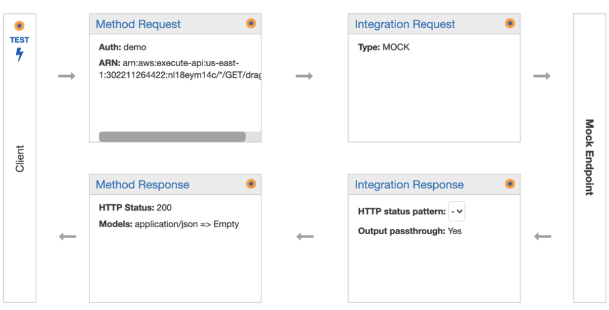

# API

## API Driven Development

API Driven Development is a process that allows developers to **focus on API design before writing code**.

## Amazon API Gateway

Amazon API Gateway is an AWS service for **creating, publishing, maintaining, monitoring, and securing REST, HTTP, and WebSocket APIs** at any scale.

Here is an example of REST API of Amazon API Gateway.

- The method request takes the client input, and optionally validates it if configured - either **against JSON Schema models** or it checks **the required request parameters in the URI, query string, and headers** of an incoming request are included and non-blank.

- The integration request is where you configure **what backend resource the API will be passing the client input to**. This is also where you perform **any mappings or data transformations** potentially using VTL Mappings.

- An integration response is an HTTP response encapsulating the backend response. You can map backend responses to specific HTTP codes. You can configure data mappings on the response from the backend at the integration request level.

- A method response returns the output from the back end to the client through an integration response.

### Request Validation

API Gateway can perform basic validation. For the basic validation, API Gateway verifies either or both of the following conditions:

- The required request parameters in the URI, query string, and headers of an incoming request are included and non-blank.

- The applicable request payload adheres to the configured JSON schema request model of the method.

Validation is performed in the Method Request and Method Response of the API.

### Models

A model in API Gateway allows you to define a schema for validating requests and responses.

### Mappings

Mappings are templates written in Velocity Template Language (VTL) that you can apply to the Integration Request or Integration Response of a REST API.

The mapping template allows you to transform data, including injecting hardcoded data, or changing the shape of the data before it passes to the backing service or before sending the response to the client.

### Stage Variables

Stage variables are name-value pairs that you can define as configuration attributes associated with a deployment stage of a REST API. They act like environment variables and can be used in your API setup and mapping templates.

With deployment stages in API Gateway, you can manage multiple release stages for each API, such as alpha, beta, and production. Using stage variables you can configure an API deployment stage to interact with different backend endpoints.

### API Gateway Stages and Deployment

Once you create a REST API in API Gateway, it doesn’t automatically become available to invoke. You need to publish the API first. In API Gateway, you publish the API to a stage.

A stage is a named reference to a deployment, which is a snapshot of the API. You use a Stage to manage and optimize a particular deployment.

Every time you make a change to your API, you must deploy it to a stage for that change to go live. You can host multiple versions of your API simultaneously by deploying changes to different stages.

Using stages is perfect for setting up dev, qa, and production environments for you API.
