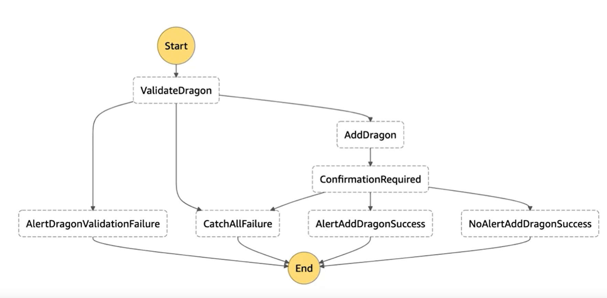

# Orchestration

## Step functions

AWS Step Functions is a reliable service to **coordinate distributed components** and **analyze the flow of your distributed workflow**.

Step Functions is based on the concepts of **tasks** and **state machines**. You define state machines using the JSON-based Amazon States Language.

For example,



### State types

States can perform a variety of functions in your state machine:

- Do some work in your state machine (a Task state)

- Make a choice between branches of execution (a Choice state)

- Stop an execution with a failure or success (a Fail or Succeed state)

- Simply pass its input to its output or inject some fixed data (a Pass state)

- Provide a delay for a certain amount of time or until a specified time/date (a Wait state)

- Begin parallel branches of execution (a Parallel state)

- Dynamically iterate steps (a Map state)

Any state type other than the Fail type have the full control over the input and the output. You can control those using the “InputPath”, “ResultPath” and “OutputPath”.

```json
{
  "Invoke Lambda State": {
    "Type": "Task",
    "Resource": "arn:aws:lambda:<region>:<account-id>:function:<function-name>",
    "Next": "Next State"
  }
}
```

### Service Integration Patterns

There are 3 standard service integration patterns:

- Response the request:

  Call a service and let Step Functions progress to the next state immediately after it gets an HTTP response. Read more about this pattern here: https://docs.aws.amazon.com/step-functions/latest/dg/connect-to-resource.html#connect-default

- Run the job:

  Call a service and have Step Functions wait for a job to complete. Read more about this pattern here: https://docs.aws.amazon.com/step-functions/latest/dg/connect-to-resource.html#connect-sync

- Wait for callback:

  Call a service with a task token and have Step Functions wait until that token is returned with a payload. Read more about this pattern here: https://docs.aws.amazon.com/step-functions/latest/dg/connect-to-resource.html#connect-wait-token

### Step function activity

Activities are used as a way to **associate code running somewhere** like Amazon EC2 or Amazon ECS, or any external compute (known as an activity worker) with **a specific task in a state machine**.

There are special fields:

- HeartbeatSeconds:

  To keep the task active and waiting, periodically send a heartbeat from your activity worker.

- TimeoutSeconds:

  It defines how long a state waits.

### Express vs Standard State Machines

- Standard Workflow

  It's ideal for **long-running, durable, and auditable** workflows.

  They can run for up to **a year** and you can retrieve the full execution history using the Step Functions API, up to 90 days after your execution completes.

  It emploies an **at-most-once model**, where your tasks and states are never executed more than once. This makes them suited to orchestrating **non-idempotent actions**.

- Express Workflow

  It's ideal for **high-volume, event-processing workloads** such as IoT data ingestion, streaming data processing and transformation, and mobile application backends.

  They can run for up to **five minutes**.

  It emploies an **at-least-once model**, where there is a possibility that an execution might be run more than once. This makes them ideal for orchestrating **idempotent actions**.

## AWS Step Functions Best Practices

- Use Timeouts to Avoid Stuck Executions

  If something goes wrong and TimeoutSeconds isn't specified, an execution is stuck waiting for a response that will never come.

- Use ARNs Instead of Passing Large Payloads

  Use Amazon Simple Storage Service (Amazon S3) to store the data, and pass the Amazon Resource Name (ARN) instead of the raw data.

- Avoid Reaching the History Quota

  Uses an AWS Lambda function that can **start a new execution** of your state machine to **split ongoing work across multiple workflow executions**.

- Handle Lambda Service Exceptions

  Sometimes, AWS Lambda might return service exceptions to a state. You should proactively handle these exceptions so if they ever occur.

- Avoid Latency When Polling for Activity Tasks

  If you have a large number of outstanding polls for each activity Amazon Resource Name (ARN), and some percentage of **your requests are stuck waiting**, there will be many more that can still get a taskToken and begin to process work.

  For production systems, we recommend **at least 100 open polls per activity ARN's at each point in time**. If one poll gets blocked, and a portion of those polls queue up behind it, there are still many more requests that will receive a taskToken to process work while the GetActivityTask request is blocked.

- Choosing Standard or Express Workflows

  You can choose Standard Workflows when you need long-running, durable, and auditable workflows, or Express Workflows for high-volume, event processing workloads.

Read more about Step Functions Best Practices here: https://docs.aws.amazon.com/step-functions/latest/dg/bp-express.html

## Event Driven Architectures

In Event Driven Architectures, there are **producers** who send events to **consumers**. It's going to be tricky when the number of producers and consumers goes up. Therefore, we need a component to decouple these 2 parts, which is the **event router**. The event router receives the data from producers, filtre them, and push them to consumers.

To implement the event router, AWS provides 4 services.

- Step function

  It orchestrates the events.

- Simple Queue Service (SQS)

  There are 2 types of the queue.

  - Standard with the best effort
  - FIFO

- Simple Notification Service (SNS)

  It's a publish/subscribe service. It's designed for high throughout and low lantency system.

- Event Bridge Service

  It's a service bus that allows us to change the schema for the events.

## Exercises

- [AWS step functions](https://aws-tc-largeobjects.s3-us-west-2.amazonaws.com/DEV-AWS-MO-BuildingNet/lab-5-stepfunctions.html)
