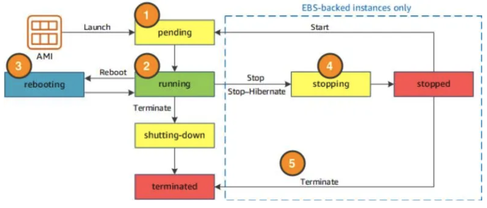
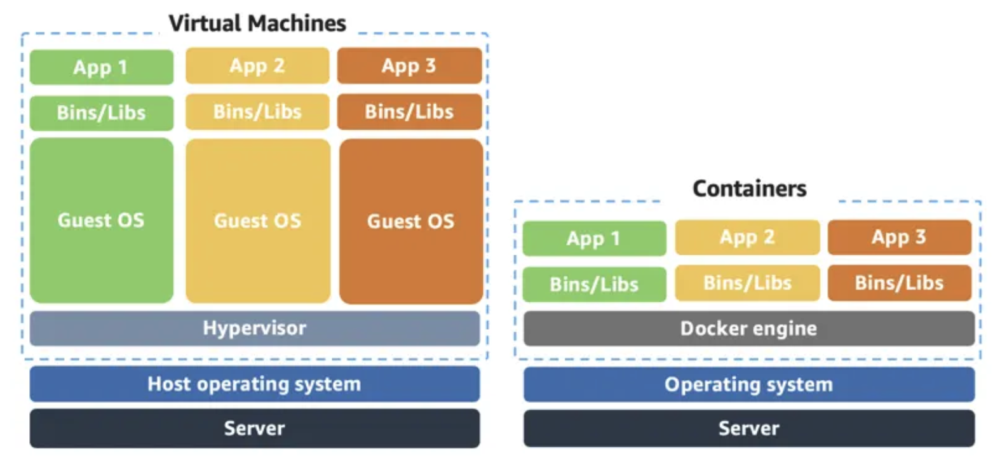

# Compute

There are three types of compute options:

- virtual machines
- container services
- serverless

## Virtual machines

Amazon Elastic Compute Cloud (EC2) is a web service that provides **secure, resizable compute capacity** in the cloud. It allows you to provision **virtual servers called EC2 instances**.

### Amazon Machine Image (AMI)

When launching an EC2 instance, the first setting you configure is which operating system you want by selecting an **Amazon Machine Image (AMI)**.

The AMI is how you model and define your instance, while the EC2 instance is the entity you interact with, where you can install your web server, and serve your content to users.

One advantage of using AMIs is that they are reusable. An image creates an instance. And we can create an image from an instance, too.

### Amazon Virtual Private Cloud (VPC)

By default, your EC2 instances are placed in a network called the default Amazon Virtual Private Cloud (VPC).

Any resource you put inside the default VPC will be public and accessible by the internet.

### EC2 Instance Lifecycle

- **stop** will lose all your data in the memory (RAM), while **stop-hibernate** won't. It will save them.

## Container services

A container is a standardized unit that **packages up your code and all of its dependencies**. This package is designed to **run reliably on any platform**, because the container creates its own independent environment.

### Container vs VM

Containers share the same operating system and kernel as the host they exist on, whereas virtual machines contain their operating system. Therefore, containers are more lightweight.

While containers can provide speed, virtual machines offer you the full strength of an operating system and offer more resources, like package installation, a dedicated kernel, and more.

### Orchestrate Containers

In AWS, **containers run on EC2 instances**. Most companies and organizations run many containers on many EC2 instances across several Availability Zones.

AWS offers two container orchestration services:

- Amazon Elastic Container Service (ECS)
- Amazon Elastic Kubernetes Service (EKS).

| Term                                                        | ECS                   | EKS         |
| ----------------------------------------------------------- | --------------------- | ----------- |
| An EC2 instance with the ECS Agent installed and configured | container instance    | worker node |
| ECS Container                                               | task                  | pod         |
| technology                                                  | AWS native technology | Kubernetes  |

## Serverless

Every definition of serverless mentions four aspects.

- No servers to provision or manage.

- Scales with usage.

- You never pay for idle resources.

- Availability and fault tolerance are built-in.

With serverless, spend time on the things that differentiate your application, rather than spending time on ensuring availability, scaling, and managing servers.

AWS has several serverless compute options, including AWS Fargate and AWS Lambda.

### AWS Fargate

AWS Fargate is a purpose-built serverless compute engine for **containers**. Fargate scales and manages the infrastructure.

### AWS Lambda

AWS Lambda lets you run code **without provisioning or managing servers or containers**.

There are three primary components of a Lambda function:

- trigger

  Triggers describe when the Lambda function should run.

- code

  The code is source code, that describes what the Lambda function should run.

- configuration

  The configuration of a Lambda function consists of information that describes how the function should run.

You pay only for what you use. You are charged for the number of times your code is triggered (requests) and for the time your code executes, rounded up to the nearest 1ms (duration). With this pricing, it can be very cost effective to run functions whose execution time is very low, such as functions with durations under 100ms or low latency APIs.
