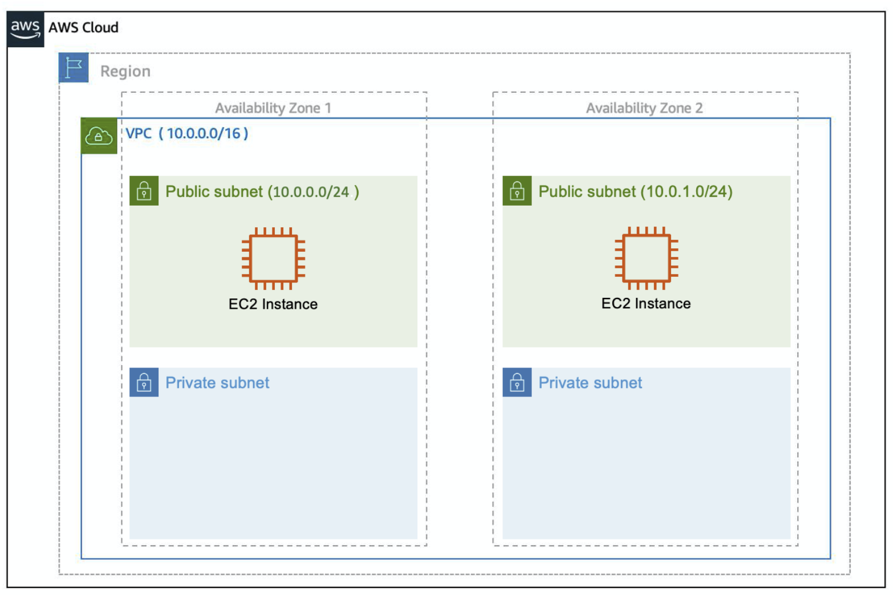
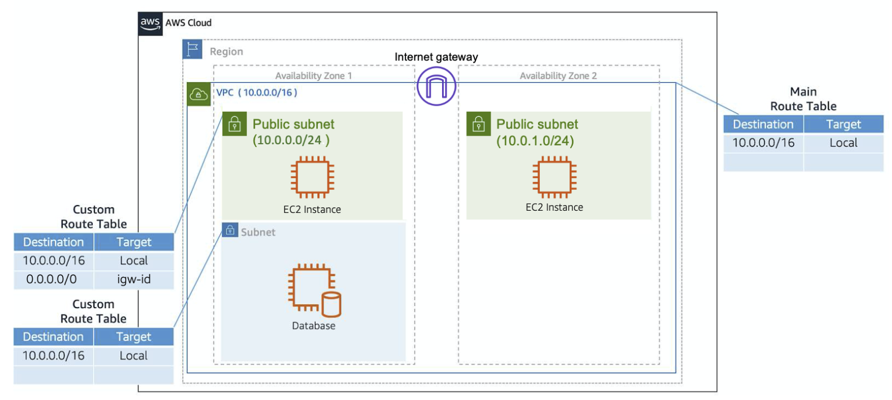

# Network

## Basic

Networking is how you connect computers around the world and allow them to communicate with one another.

Each computer has an IP address, a combination of bits, 0s and 1s. Typically, you don’t see an IP address in this binary format. Instead, it’s converted into decimal format and noted as an Ipv4 address. the 32 bits are grouped into **groups of 8 bits**, also called **octets**. E.g. `192.168.30.O`.

192.168.1.30 is a single IP address. If you wanted to express IP addresses between the range of 192.168.1.0 and 192.168.1.255, how can you do that? `192.168.1.0/24`.

The number at the end specifies how many of the bits of the IP address are fixed. In this example, the first 24 bits of the IP address are fixed.

## Amazon VPC

A VPC is an isolated network you create in the AWS cloud, similar to a traditional network in a data center. When you create a VPC, you need to choose three main things.

1. The name of your VPC.

2. A Region for your VPC to live in. Each VPC spans multiple Availability Zones within the Region you choose.

3. A IP range for your VPC in CIDR notation. This determines the size of your network. Each VPC can have up to four /16 IP ranges.

There are 2 types of gateways:

- Internet Gateway:

  It enables internet connectivity for your VPC.

- Virtual Private Gateway

  It allows you to connect your AWS VPC to another private network.

### Routing and Security

When you create a VPC, AWS creates a route table called the **main route table**. A route table contains a set of rules, called routes, that are used to determine where network traffic is directed.

There are two main parts to this route table.

- The destination, which is a range of IP addresses where you want your traffic to go.

- The target, which is the connection through which to send the traffic.

A **network ACL** enables you to control what kind of traffic is allowed to enter or leave your subnet, as **a firewall at the subnet level**.

The next layer of security is for your **EC2 Instances**. Here, you can create a firewall called a **security group**.

A common design pattern is organizing your resources into different groups and creating security groups for each to control network communication between them.

## Exercise

[AWS VPC](https://aws-tc-largeobjects.s3-us-west-2.amazonaws.com/DEV-AWS-MO-GCNv2/lab-4-networking.html)
