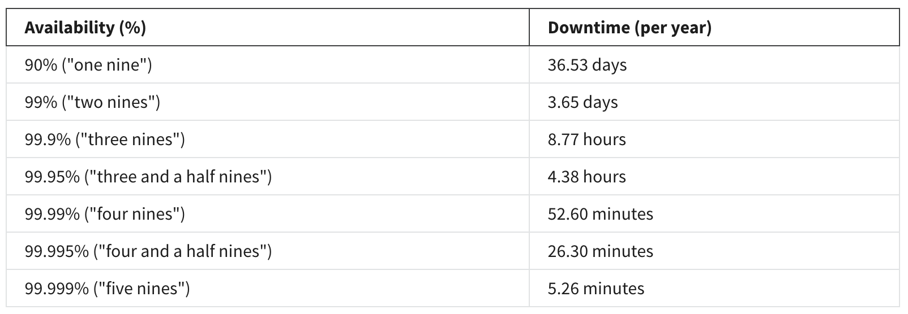
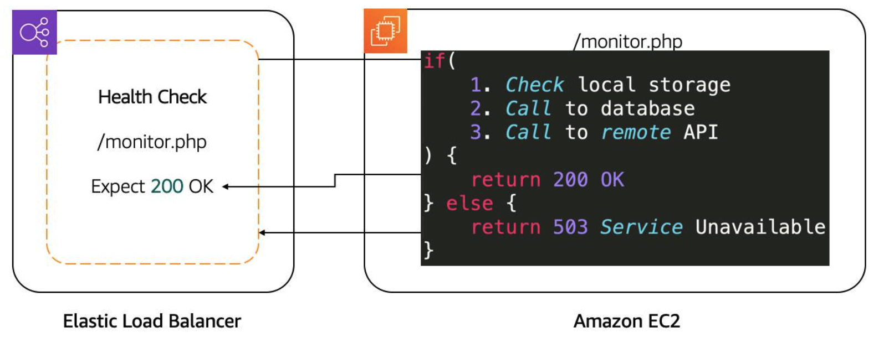
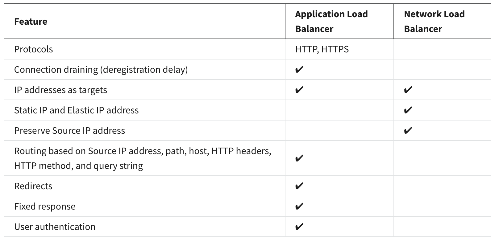

# Optimization

## Availability

The availability of a system is typically expressed as **a percentage of uptime** in a given year or as a number of nines.

To improve the availability, we use a second Availability Zone. However, having more than one instance brings new challenges.

- Create a Process for Replication

  The best method is to automate where you can.

- Address Customer Redirection

  - The most common is **using a Domain Name System (DNS)** where the client uses one record which points to the IP address of all available servers. However, the time it takes to update that list of IP addresses and for the clients to become aware of such change.

  - Another option is to use a **load balancer** which takes care of health checks and distributing the load across each server. Being between the client and the server, the load balancer avoids propagation time issues.

- Understand the Types of High Availability

  There are 2 types of hig availability.

  - Active-Passive: **Only one** of the two instances is available at a time. It works well with **stateful application** where data about the client’s session is stored on the server, there won’t be any issues as the customers are always sent to the same server where their session is stored.

  - Active-Active: All the instances are available. It shines in **scalability**. However, the application need to be **stateless** because there would be an issue if the customer’s session isn’t available on all the servers.

## Load balance

Load balancing refers to the process of **distributing tasks across a set of resources**.

To do this, you first need to enable the load balancer to take all of the traffic and redirect it to the backend servers based on an algorithm. The most popular algorithm is **round-robin**, which sends the traffic to each server one after the other.

### Health Checks

Taking the time to define an appropriate health check is critical.

### ELB Components

Elastic Load Balancing (ELB) is made up of three main components.

- **Listeners**: The client connects to the listener. This is often referred to as client-side. To define a listener, a **port** must be provided as well as the **protocol**, depending on the load balancer type.

- **Target groups**: The backend servers, or server-side, is defined in one or more target groups. This is where you **define the type of backend** you want to direct traffic to, such as EC2 Instances, AWS Lambda functions, or IP addresses. Also, a **health check** needs to be defined for each target group.

- **Rules**: To associate a target group to a listener, a rule must be used. Rules are made up of a condition that can be **the source IP address of the client** and a condition to decide **which target group to send the traffic to**.

### Select Between ELB Types

## Amazon EC2 Auto Scaling

There are three main components to EC2 Auto Scaling.

- Launch template or configuration: What resource should be automatically scaled?

- EC2 Auto Scaling Group: Where should the resources be deployed?

- Scaling policies: When should the resources be added or removed?

## Exercises

- [Configure High Availability for your Application
](https://aws-tc-largeobjects.s3-us-west-2.amazonaws.com/DEV-AWS-MO-GCNv2/lab-7-elb.html)
