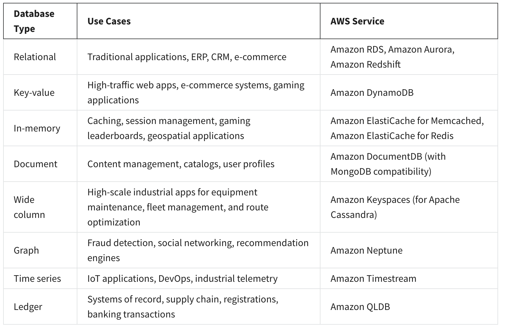

# Storage

AWS storage services are grouped into three different categories:

- file storage

  You place your files in a **tree-like hierarchy** that consists of folders and subfolders.

  File storage is ideal when you require centralized access to files that need to be easily shared and managed by multiple host computers.

- block storage

  Block storage **splits files into fixed-size chunks of data called blocks** that have their own addresses. Since each block is addressable, blocks can be retrieved efficiently.

  It is a typical storage choice for **high-performance enterprise workloads**, such as databases or enterprise resource planning (ERP) systems, that require low-latency storage.

- object storage

  **Each object is a file with a unique identifier**. This identifier, along with any additional metadata, is bundled with the data and stored.

  Object storage is generally useful when storing large data sets, unstructured files like media assets, and static assets, such as photos.

## Amazon EC2 Instance Store

Amazon EC2 Instance Store provides **temporary block-level storage** for your **instance**.

This storage is located on disks that are physically attached to the host computer. This ties the lifecycle of your data to the lifecycle of your EC2 instance.

## Amazon Elastic Block Storage (Amazon EBS)

Amazon EBS is a **block-level storage device** that you can **attach to an Amazon EC2 instance**.

## Amazon S3

Unlike Amazon EBS, Amazon S3 is **a standalone storage solution that isn’t tied to compute**.

Amazon S3 is an **object storage service**.

Amazon S3 provides two main access management features:

- IAM policies
- S3 bucket policies

## AWS Database Services

## Exercises

- [Storage](https://aws-tc-largeobjects.s3-us-west-2.amazonaws.com/DEV-AWS-MO-GCNv2/lab-5-storage.html)

- [Database](https://aws-tc-largeobjects.s3-us-west-2.amazonaws.com/DEV-AWS-MO-GCNv2/lab-6-databases.html)
