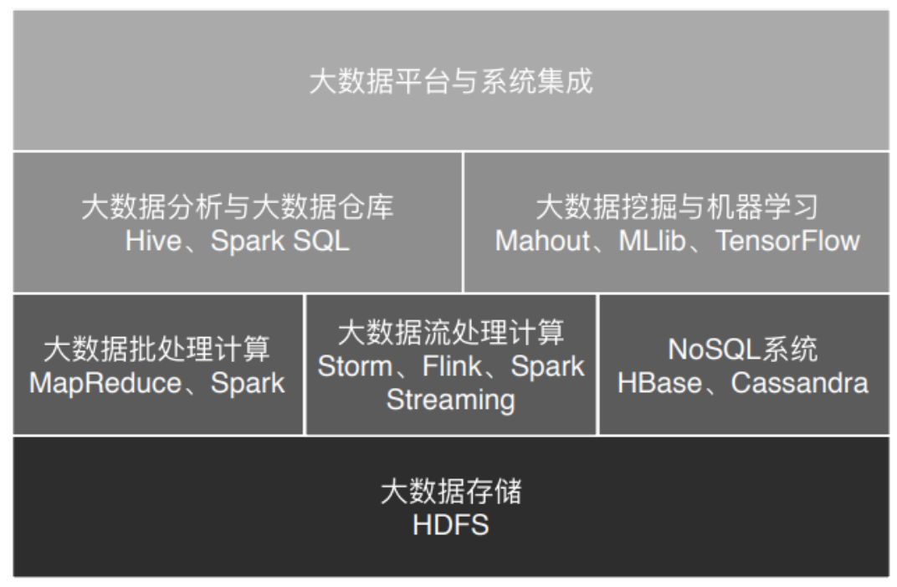

# Background

## Timeline

- 2004: Google published the thesis **MapReduce**. It's the fondation of distributed system.

- 2006: **Hadoop** is created based on MapReduce

- 2008: **Hive** is created for **translated SQL into MapReduce**.

- 2012: **Yarn** is created as **Capacity Scheduler**.

- 2012: **Spark** is created. Its performance is much better than MapReduce.

- 2014: **Flink** is creating for **real-time streaming**. By the way, Spark and MapReduce handle the **batch processing**, which is offline.

