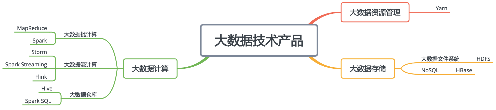

# Learning Big Data from scratch

1. [Background](./background.md)

2. [Hadoop principles](./hadoop.md)

3. Hadoop ecosystem

   - Hive: a tool that translate SQL into MapReduce

   - [Spark](./spark.md): A powerful big data framework

   - [HBase](./hbase.md): A database based on HDFS for big data

   - [Streaming Frameworks](./streaming-framworks.md)

     Besides the batch processing (MapReduce, Spark, etc), Streaming process is also important in Big data.

   - [ZooKeeper](./zookeeper.md): An application widly used in big data for choosing the master server

   

   HDFS is the basic storage tech that supports the entire ecosystem. HBase is a NoSQL database based on HDFS. MapReduce and Spark are the batch processing frameworks, while Storm, Spark steaming, and Flink are the streaming process framework. Yarn is the one that allocate resource to either batch processing and stream processing.

   In producione, we usually **deploy all these application in a cluster**. That means a server can run a DataNode of HDFS, NodeManager of YARN, and Spark program managed by Yarn. Hive and Spark SQL will parse the SQL by the big data engine and let Yarn manage the Spark jobs. On the other hand, **HBase is deployed on a seperated cluster** from other Hadoop applications because online business requires it. Therefore, it usually cost more resources.
