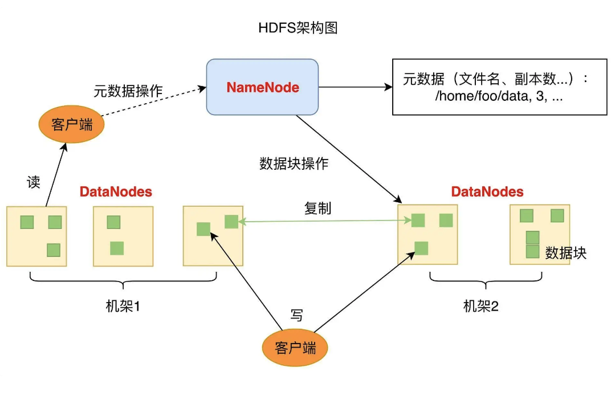
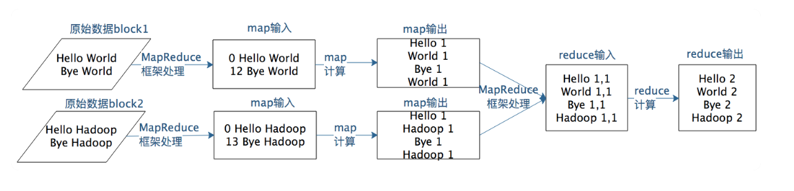
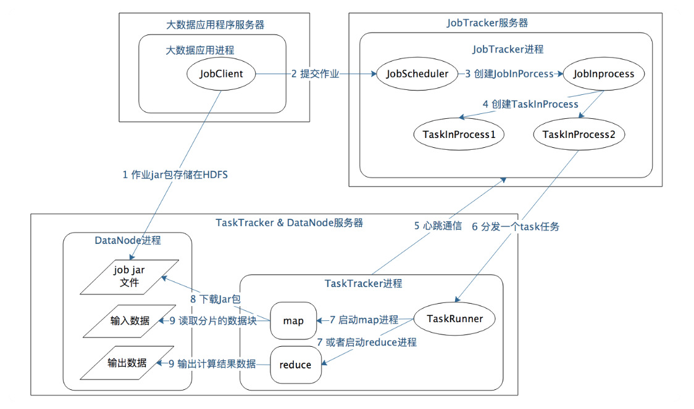
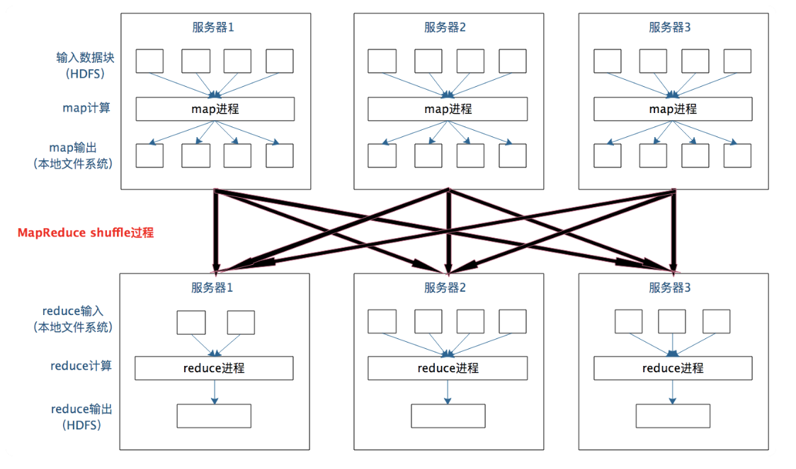
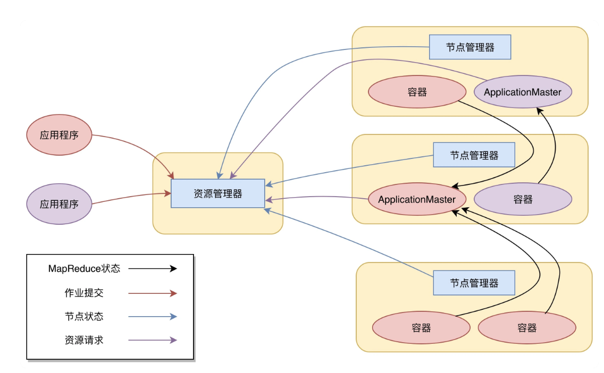

# Hadoop Big Data principles

## Moving programs to data

Since it's expensive to move big data to a centralized machine, we move the programs to the machine where data lives. The process is as followed:

1. We put data on the **clusters** of servers

Data is saved in HDFS files in **blocks**.

2. Big data engine **allocates the processes to the servers** based on their performance.

3. We program in Hadoop or Spark, and package the codes in JAR file (since Hadoop or Spark runs in JVM).

4. Engine finds the paths to the data, **split them in pieces**, and sends the pieces to processes.

5. Once the process receives the task, it will check if it has the corresponded program. If not, it will download it. Then, it executes the task.

## Hadoop File System (HDFS)

- **DataNode**: It handles reading and writing data. Each data node has some blocks. In pratice, there are a lot of data nodes in a cluster.

- **NameNode**: It handles the metadata, such as file paths, block ID, etc. HDFS will make multiple copies for a block (usually 3), and save them on different servers.

HDFS solves the problems of read/write speed, volumn limit, and availability. Availability is the most important problem.

- Error occurs when reading writing data

  Data node will **check the CheckSum when reading and writing data** to make sure the data is correct.

- Disk error

  If data node dectects a disk error, it will **report it to name node**, and name node will check other data nodes to make the number of copies remain unchanged.

- Data node error

  Data node will send **heat beat** to name node to make sure that name node always know the health of data node.

- Name node error

  If name node fails, the entire HDFS fails. Name node follow main-sub pattern. There are 2 name nodes in HDFS managed by **Zookeeper**. Only main name node can send commands to data nodes.

To maintain the availability, there are 3 ways:

- Redundant backup

- Failover

  If a piece of data can't be visited, we need to visit the copies.

- Limiting

  If there are too many requests, we need to limit the access to the resources.

## MapReduce

The process of MapReduce is as followed:

1. map a kv pair into another one -> `Map(k -> v)`
2. group the pairs by key -> `Map(k -> Collection[v])`
3. reduce the key-collection pairs to result -> `Map(k -> result)`

Dive into details:

- **Application process** will send jobs to **JobTracker** server.

- **JobTracker** will create tasks based the job and send tasks to **TaskTracker**.

- **TaskTracker** will run `map` or `reduce` based on the task.

A JobTracker has multiple TaskTracker. It's main-sub pattern.

Between `map` and `reduce`, there is another process, `shuffle`. It **groups related data from different servers by key** for the further processes.

## Yarn

In Hadoop 1, JobTracker and TaskTracker handles

1. send `map` or `reduce` function to the servers
2. execute these function

Yarn is created for taking over the first point. Therefore, Yarn's full name is Yet Another Resource Negotiator.

1. The client send application to Yarn, which includes MapReduce AppplicationMaster, MapReduce programs, and MapReduce Application start command.

2. ResourceManager talks to NodeManager for allocate resources, and send MapReduce ApplicationMaster to NodeManager.

3. MapReduce ApplicationMaster starts, and regirsters itself to ResourceManager for resources.

4. After receiving resource, MapReduce ApplicationMaster send MapReduce programs to NodeManager and ask it to run them.

5. During the execution, MapReduce programs reports the status to MapReduce ApplicationMaster.

6. After finishing the task, MapReduce ApplicationMaster will log out from ResourceManager and release the resource.
