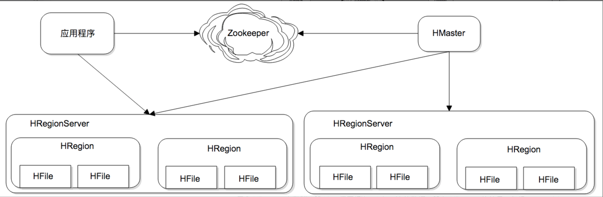
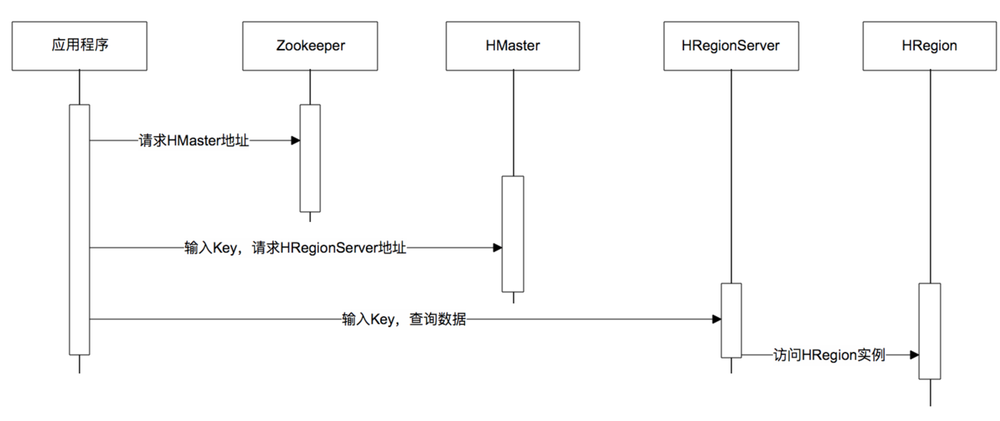
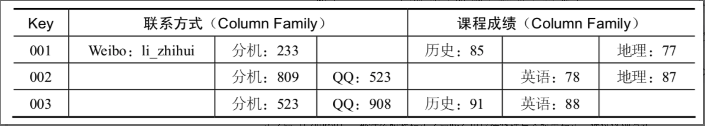

# HBase

HBase is a database designed for scalable big data.

- **HRegion** is the process that saves the data with the key between `key1` to `key2`.

- **HRegionServer** is the physical server that hosts HRegion.

- **HMaster** keeps the information about all the HRegionServers, THere are multiple HMaster managed by Zookeeper.

Here is how to visit data in HBase:

## Data Model

Unlike relational database, HBase doesn't have a schema. We only need to define the **Colume**. The data in a column doesn't need to fit a same format.

## High performace storage

HBase uses LSM Tree (Log Structed Merge Tree).

It writes data as logs in RAM, and merges trees in RAM to those in disks asynchronously. It reads data in RAM first. If the data is not found, then it reads data in disks.
