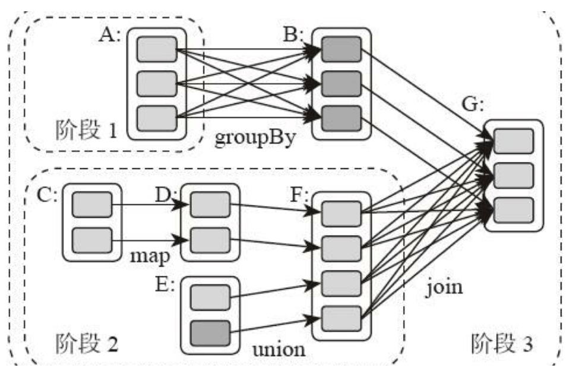

# Spark

Spark is built after MapReduce. It has several advantages.

1. API is more **friendly** for developers.

2. It uses **RAM** for calculating.

3. It has more calculation **stage**.

Spark's core is **RDD** (Resilient Distributed Dataset).

RDD has 2 kinds of functions:

- action: `count`, `saveAsTextFile`, etc

- transformation: `map`, `filter`, `reduceByKey`

  Transformation can be classified by whether applying `shuffle`. `map` doesn't shuffle, therefore it doesn't create new RDD. It's fast. However, `reduceByKey` needs shuffling. It creates new RDD, and it costs time.
