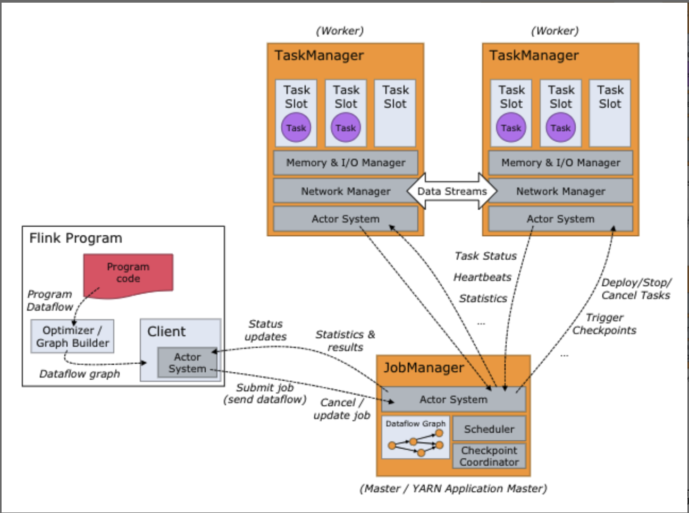

# Streaming frameworks

## Storm

Before Big Data, **message queue** is used for saving real time data. Between the message queues, there are blocks for processing data.


Storm is created for solving these 2 tasks. Similar to Hadoop, **nimbus** keeps all the information about **supervisor**s, and superviser has multiple **worker**s to run the tasks. Nimbus is managed by **Zookeeper**.

## Spark Streaming

Spark Streaming **transforms streaming into batches**, then passes batches to Spark engine.


```scala
// package the streaming per 1s
val ssc = new StreamingContext(conf, Second(1))
```

## Flink

Flink focuses on streaming processing, but it can handle batch processing, too.

For streaming processing, it will create **StreamExecutionEnvironment** and **DataStream**.

```java
StreamExecutionEnvironment see = StreamExecutionEnvironment.getExecutionEnvironment();

DataStream<WikipediaEditEvent> edits = see.addSource(new WikipediaEditsSource());
```

For batch processing, it will create **ExecutionEnvironment** and **DataSet**.

```java
ExecutionEnvironment env = ExecutionEnvironment.getExecutionEnvironment();

DataSet<String> text = env.readTextFile("/path/to/file");
```

We can apply **transformation** on both DataStream and DataSet.

Fink's structure is similar to Yarn or Hadoop 1. **JobManager** has all the information of **TaskManager**, and TaskManager has multiple **TaksSlot** to run the tasks.


