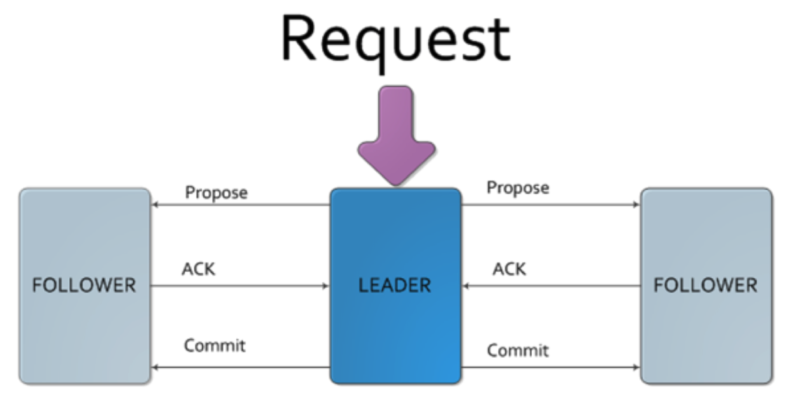

# Zookeeper

Zookeeper makes sure all the sub-servers (e.g. DataNode in HDFS) report to a single master server (e.g. NameNode in HDFS).

It provides the **consistency** to the distributed system.

## ZAB (Zookeeper Atomic Broadcast)

ZAB is the core algo of Zookeeper.

According ZAB, there is a **leader** among all the servers.

When there is a write operation, the leader server will **propose** this operation to all the **follower** servers. If there are multiple write request arrive at the same time, the leader must select **only one** of them and propose.

If the follower server agrees with this write opertion, it will send an **ACK** signal to the leader server.

If all the follower servers agree, the leader server will ask all the followers to **commit** this write operation.

