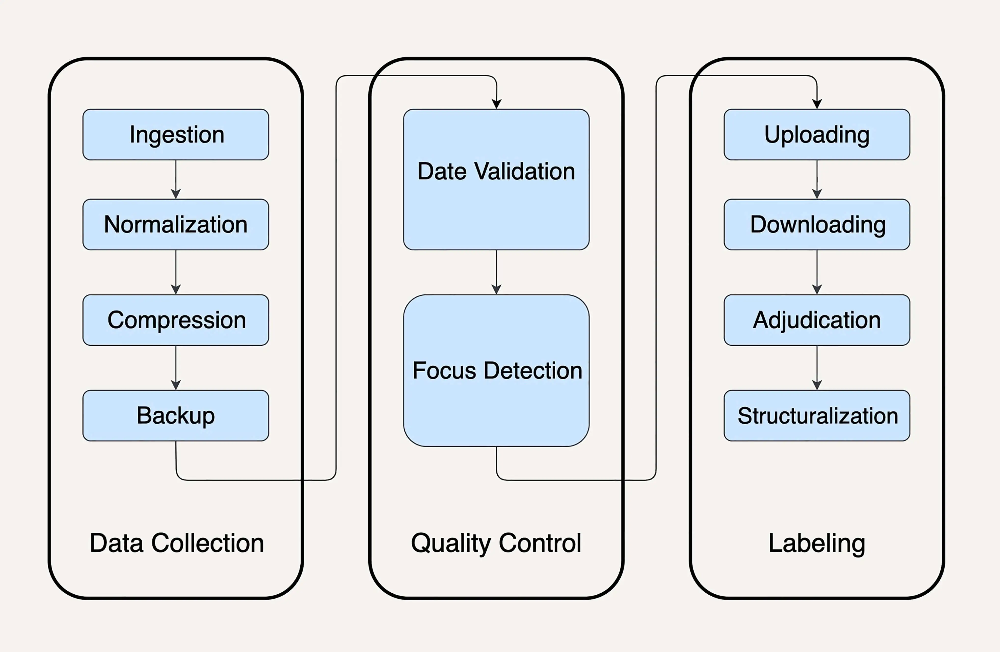

# Overview

- Data collection

  - Data ingestion: collect data from different sources

  - Data normalization: unify the data format

  - Compression: minimize the data storage

  - Backup: backup the comnpressed data

- Quality control

  - Data validation: check the data if they fit the needs

  - Focus detection: Filter the data that can't be used

- Labeling

  - Uploading: upload the data that need to be labeled by humain

  - Downloading: download the labeled data

  - Adjudication: adjust the conflicted label of a piece of data

  - Structuralization: structuralize the labeled data for the data storage