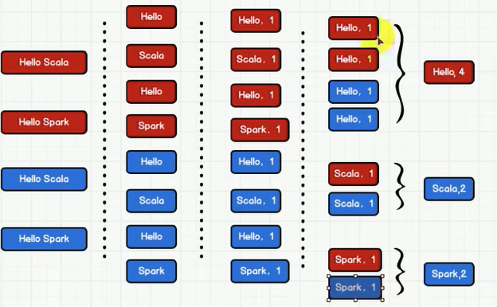

# WordCount

`WordCount` is a classic big data program. It counts the words from different files.

For example, we have 2 file, [1.txt](../data/1.txt) and [2.txt](../data/2.txt).
We want to get the result as `(Hello, 4), (Scala, 2), (Spark, 2)`. The process is as followed.

The code can be found [here](../spark-core/src/main/java/org/jijie/spark/core/wordcount/WordCount2.scala).
You can notice that Spark APIs are really similar to Scala Collection APIs.

However, Spark provides more APIs. For example, `reduceByKey(...)` can replace `groupBy(key => key).map(...)`.
The code can be found [here](../spark-core/src/main/java/org/jijie/spark/core/wordcount/WordCount3.scala)