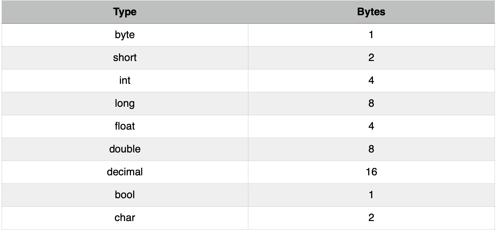
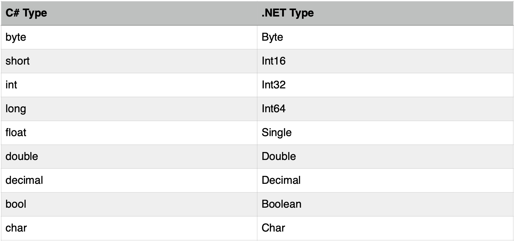

# Primitive type



The range of `byte` is 0 to 255.

> 1 byte = 8 bits

The range of `int` is -2<sup>32</sup> to 2<sup>32</sup>. It's **signed 32-bit integer**.



By default, the real number type is `double`. If we want to create a `float` number or a `decimal` number:

```c#
float a = 1.1f;
decimal b = 2.3m;
```

## Variable vs Constant

```c#
int num;
const float Pi = 3.14f;
```

## Type conversion

1. Cast expression

   ```c#
   int i = 1;
   byte b = (byte)i;
   ```

   It's very limited. It only works for conversing small data type to big one.

2. `Convert` class

   ```c#
   string n = "123";
   int i = Convert.ToInt32(n);
   ```
