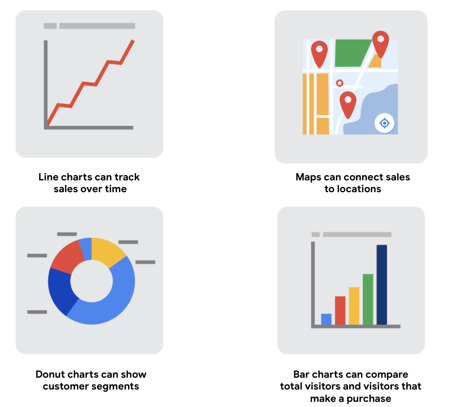

# Data visualization

Data visualizations are **pictures**, they are a wonderful way to take very basic ideas around data and data points and make them come alive.

Data visualization allows you:

- explain complex data quickly

- explore data

- create interesting graphs

## Steps to plan a data visualization

1. Explore the data for patterns

2. Plan your visuals

3. Create your visuals

   

   Build your data visualization toolkit

   - You can use the visualizations tools in your **spreadsheet** to create simple visualizations such as line and bar charts.

   - You can use more advanced tools such as **Tableau** that allow you to integrate data into dashboard-style visualizations.

   - If you’re working with the programming language **R** you can use the visualization tools in RStudio.
