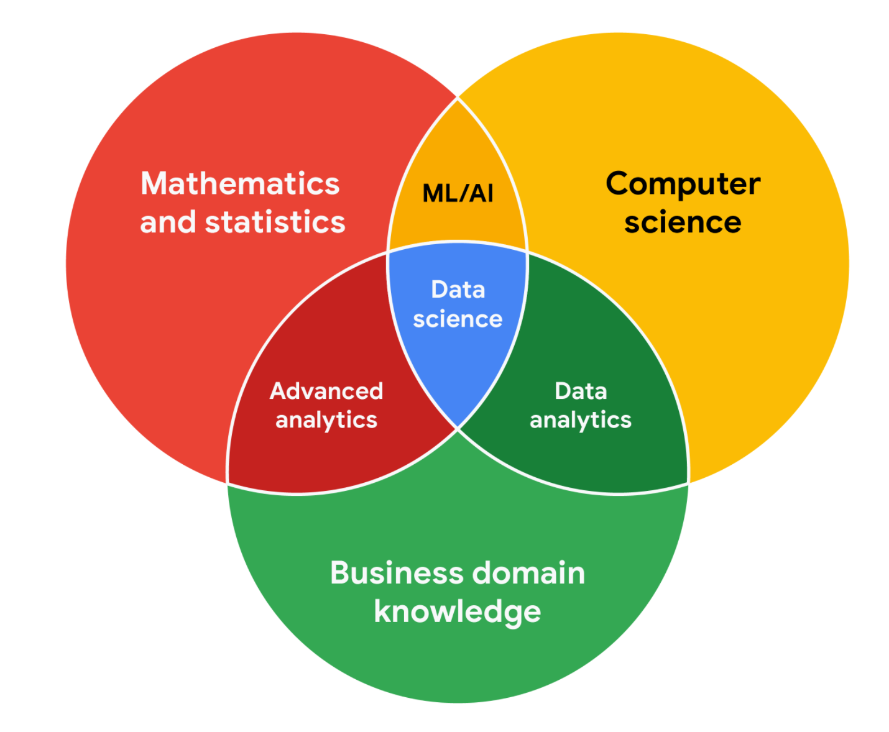

## Stakeholders and teams

### Working with stakeholds

Stakeholders are people who have invested time, interest, and resources into the projects.

There are three common stakeholder groups that you might find yourself working with: **the executive team, the customer-facing team, and the data science team**.

#### Executive team

The executive team provides **strategic and operational leadership** to the company.

The executive team might include **vice presidents, the chief marketing officer, and senior-level professionals**.

Part of your job will be balancing what information they will need to make informed decisions with their busy schedule.

#### Customer-facing team

The customer-facing team includes anyone in an organization who has some level of interaction with **customers and potential customers**.

Part of your work might involve collecting and sharing data about consumers’ buying behavior to help inform product features. Here, you want to be sure that your analysis and presentation focuses on **what is actually in the data**.

#### Data science team

It's your work team. It includes **data analysts, data scientists, and data engineers**.

### Working effectively with stakeholders

- **Discuss goals**

- **Feel empowered to say “no”**

- **Plan for the unexpected**

  make a list of potential roadblocks

- **Know your project**

  Keep track of your discussions about the project

- **Start with words and visuals**

  start with a description and a quick visual of what you are trying to convey to avoid the illusion of agreement

- **Communicate often**

### Focus on what matters

- Who are the primary and secondary stakeholders? 
- Who is managing the data? 
- Where can you go for help?
