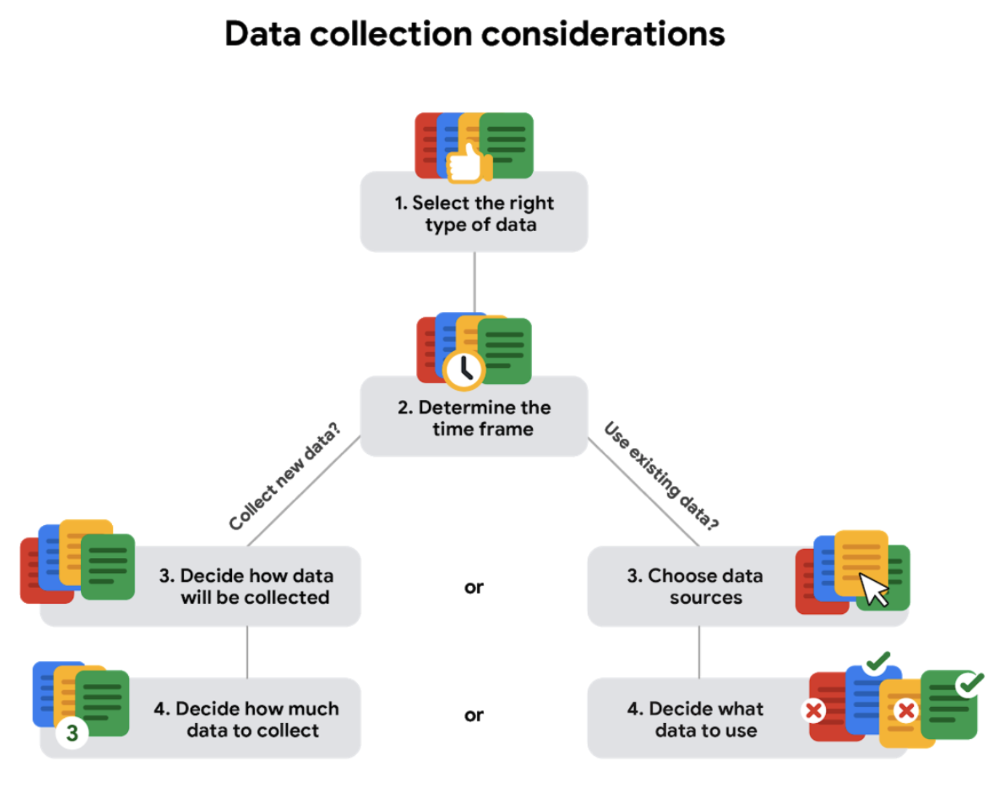

# Collecting Data

## How data is collected

- Interviews

- Observations

- Forms

- Questionnaires

- Surveys

- Cookies

## Considerations

- How data will be collected

- Choose data sources

  - First-party data: This is data collected by an individual or group using their **own resources**.

  - Second-party data: The data collected by a group directly from **its audience** and then **sold**.

  - Third-party data: The data collected from **outside sources** who did **not collect it directly**.

- Decide what data to use

- How much data to collect

- Select the right data type

- determine the time frame

