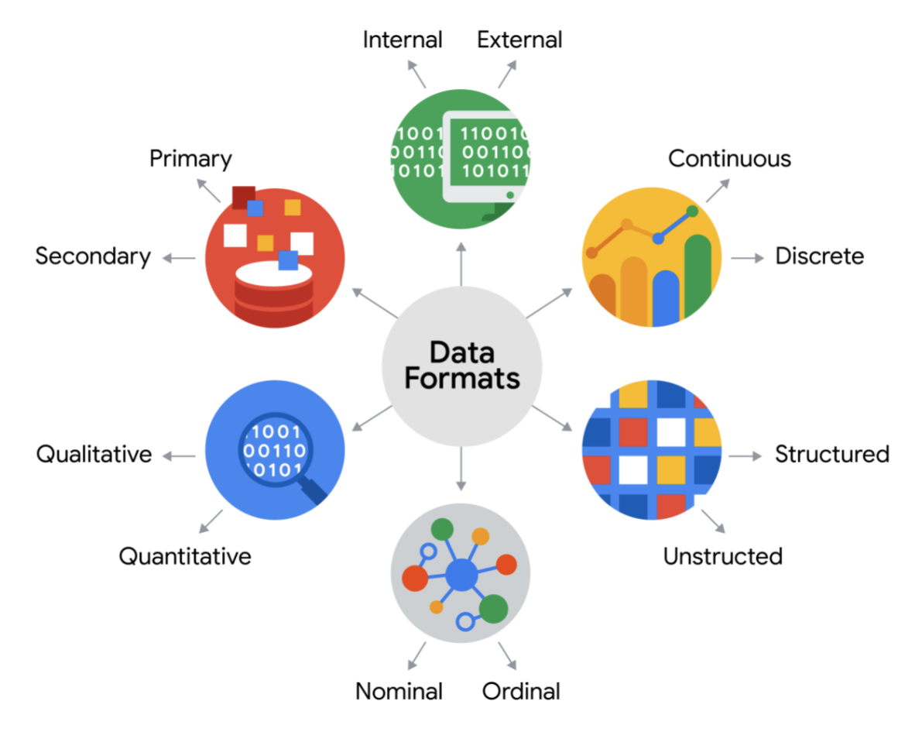

# Data type

As dicussed before, data can be split into **qualitative and quantitative**.

The quantitative can be classfied in 2 different types: **discrete and continuous**.

## Discrete data vs Continuous data

- Discrete data: It can be **counted** and have **a limited number of values**.

- Continuous data: It can be measured using a **timer**, and its value can be shown as **a decimal with several places**.

## Nominal data vs Ordinal data

- Nominal data: It is a type of **qualitative** data that's categorized **without a set order**.

- Ordinal data: It's a a type of **qualitative** data with **a set order or scale**.

## Internal data vs External data

The internal data that lives within a company's own systems.

## Structured data vs Unstructured data

- Structured data: It is data that's organized in a **certain format**, such as rows and columns. It's easier to **store, search and analyze**.

- Unstructured data: This is data that is **not** organized in any easily **identifiable manner**.

# Data model

Data modeling is the process of **creating diagrams** that visually represent how data is organized and structured. These visual representations are called data models.

Data model that is used for **organizing data elements** and how they relate to one another.

Data models help to **keep data consistent** and **provide a map of how data is organized**.

## Data element

They're pieces of information, such as people's names, account numbers, and addresses

## Levels of data modeling

1. **Conceptual data modeling** gives a high-level view of the data structure, such as how data interacts across an organization.

2. **Logical data modeling** focuses on the technical details of a database such as relationships, attributes, and entities.

3. **Physical data modeling** depicts how a database operates. A physical data model defines all entities and attributes used.

## Data-modeling techniques

- **Entity Relationship Diagram (ERD)**

  ERDs are a visual way to understand the relationship between entities in the data model.

- **Unified Modeling Language (UML)**

   UML diagrams are very detailed diagrams that describe the structure of a system by showing the system's entities, attributes, operations, and their relationships. 
