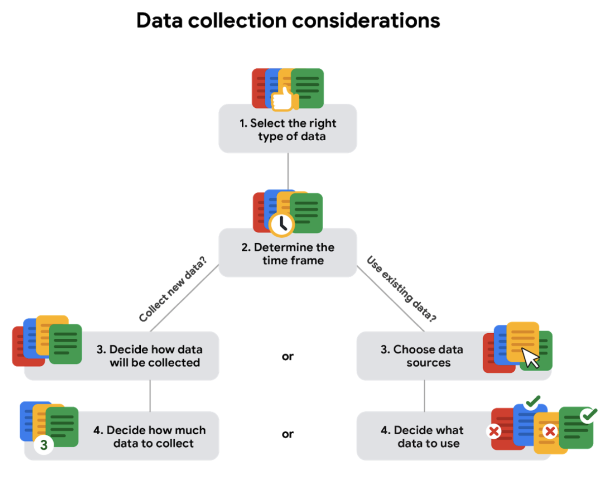

## Collecting Data

### How data is collected

- Interviews

- Observations

  The scientists use a lot of observations.

- Forms

- Questionnaires

- Surveys

- Cookies

  It's widely used on the Internet.

### Considerations

- How data will be collected

- Choose data sources

  - First-party data: This is data collected by an individual or group using their **own resources**.

  - Second-party data: The data collected by a group directly from **its audience** and then **sold**.

  - Third-party data: The data collected from **outside sources** who did **not collect it directly**.

- Decide what data to use

  If you needed an answer **immediately**, you'd have to use **historical data**, which is data that already exists.

- How much data to collect

  - A **population** refers to all possible data values in a certain data set.

  - A **sample** is a part of a population that is representative of the population.

- Select the right data type

- determine the time frame

