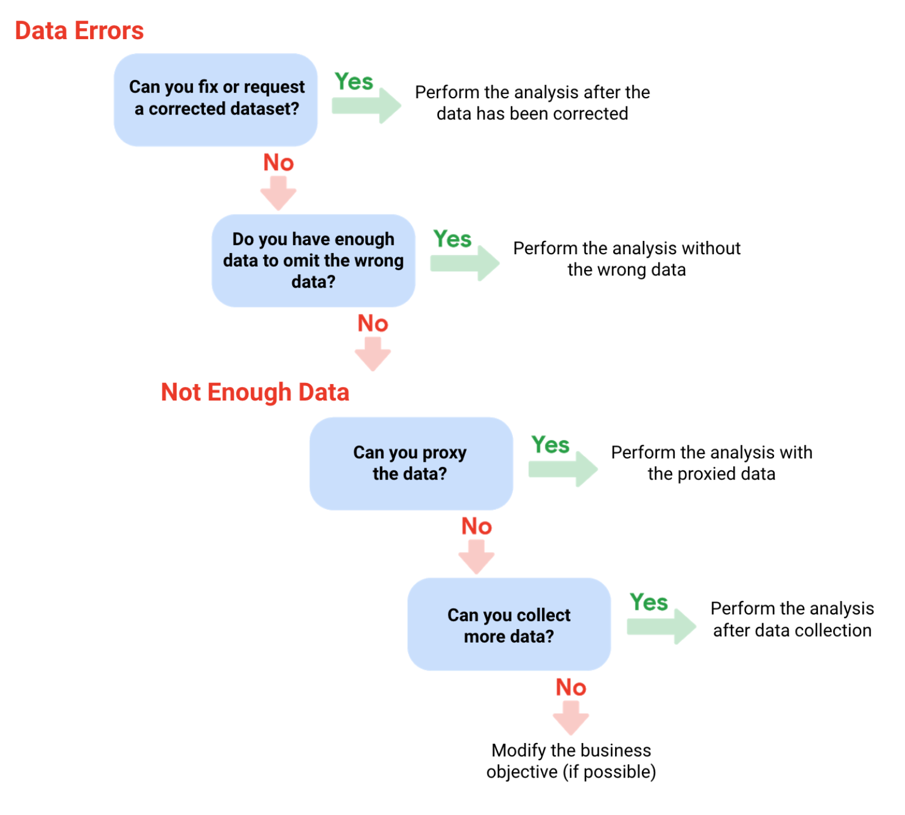

## Insufficient data

### Types

- Data from only one source
- Data that keeps updating
- Outdated data
- Data that's geographically-limited

### Ways to address insufficient data

- identify trends with the available data
- wait for more data if time allows
- talk with stakeholders and adjust your objective
- look for a new data set.

### Deal with data errors

### Sample Size (Sample)

A part of a population that's representative of the population.

The goal is to get enough information from a small group within a population to make predictions or conclusions about the whole population.

#### Terms

| Terminology              | Definitions                                                                                                                                                               |
| ------------------------ | ------------------------------------------------------------------------------------------------------------------------------------------------------------------------- |
| Population               | The entire group that you are interested in for your study.                                                                                                               |
| Sample                   | A subset of your population.                                                                                                                                              |
| Margin of error          | This difference is between the sample’s results and population's results.                                                                                                 |
| Confidence level         | How confident you are in the survey results.                                                                                                                              |
| Confidence interval      | **The range of possible values** that the population’s result would be **at the confidence level** of the study. This range is the sample result +/- the margin of error. |
| Statistical significance | The determination of whether your result could be due to **random chance** or not. The greater the significance, the less due to chance.                                  |

#### Things to remember when determining the size of your sample

- Don’t use a sample size less than **30**.

  It has been statistically proven that 30 is the smallest sample size where an average result of a sample starts to represent the average result of a population.

- The confidence level most commonly used is **95%**, but 90% can work in some cases.
