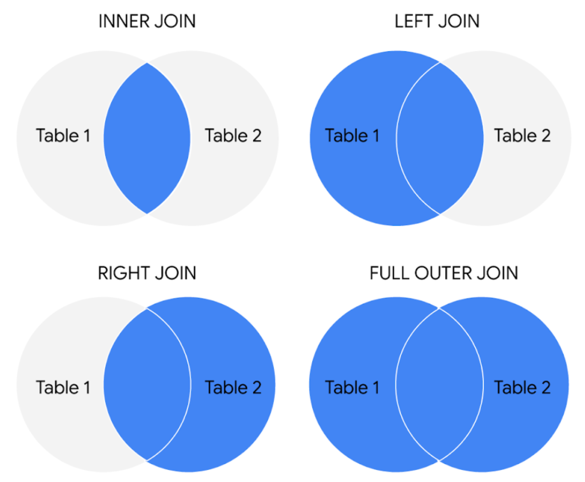

# Data aggregation

Data aggregation helps data analyst:

- identify trends
- make comparisons
- gain insights

## VLOOKUP (Spreadsheet)

VLOOKUP stands for **vertical lookup**.

Basically, it's a function that searches for a certain value in a column to return a corresponding piece of information.

VLOOKUP has 4 parameters.

```code
=VLOOKUP(
  What you want to look up,
  Where you want to look for it,
  The column number in the range containing the value to return,
  Return an Approximate or Exact match – indicated as 1/TRUE, or 0/FALSE
).
```

> Usually, we use **absolute reference** in the second parameters. For exemple, `Sheet2!$A$2:$D$9`.

Before using VLOOKUP, we need the clean the data first.

- `VALUE`: convert string to number
- `TRIM`: remove extra spaces

VLOOKUP only **returns the first match** it finds and can only search to the **right**.

- You want the column that matches the search key in a VLOOKUP formula to be on the left side of the data. VLOOKUP only looks at data to the right after a match is found. In other words, the index for VLOOKUP indicates columns to the right only. This may require you to move columns around before you use VLOOKUP.

## JOIN (SQL)

- **INNER JOIN**: return the records that exist **where the tables are overlapping**.

- **LEFT JOIN**: return **all the records from the left table** and only the **matching records from the right table**.

- **RIGHT JOIN**: return **all records from the right table** and only the **matching records from the left**.

- **OUTER JOIN**: combines RIGHT and LEFT JOIN to return **all matching records in both tables**.



## Subquery (SQL)

- A subquery may be nested in a SELECT clause.

- For a subquery to compare multiple columns, those columns must be selected in the main query.

- A SET command can’t have a nested subquery because it is used with UPDATE to adjust specific columns and values in a table.
