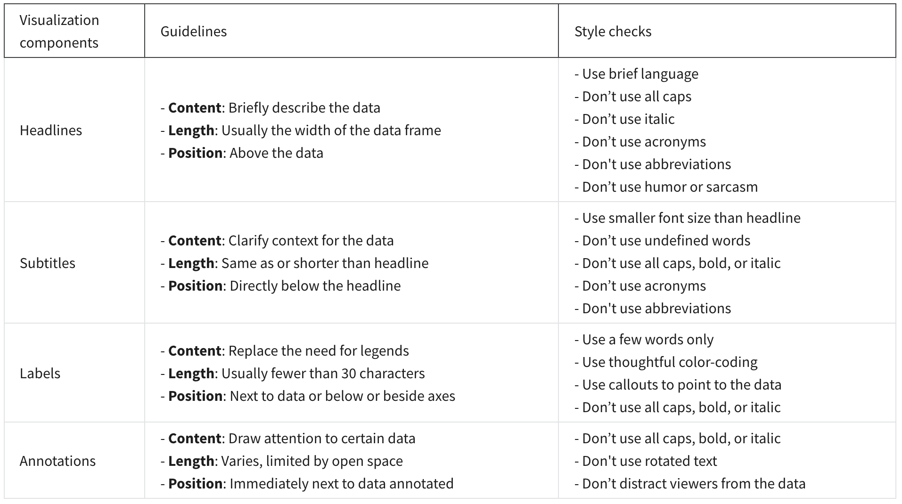

## Accessibility

### Highlighting key information

- **Headlines that pop**

  A headline is a line of words printed in large letters at the top of a visualization to communicate what data is being presented.

- **Subtitles that clarify**

  A subtitle supports the headline by adding more context and description.

- **Labels that identify**

  A label in a visualization identifies data in relation to other data.

- **Annotations that focus**

  An annotation briefly explains data or helps focus the audience on a particular aspect of the data in a visualization.

### Ways to make data visualization accessible

- Labeling

- Text alternatives

- Text-based format

- Distinguishing

- Simplify
