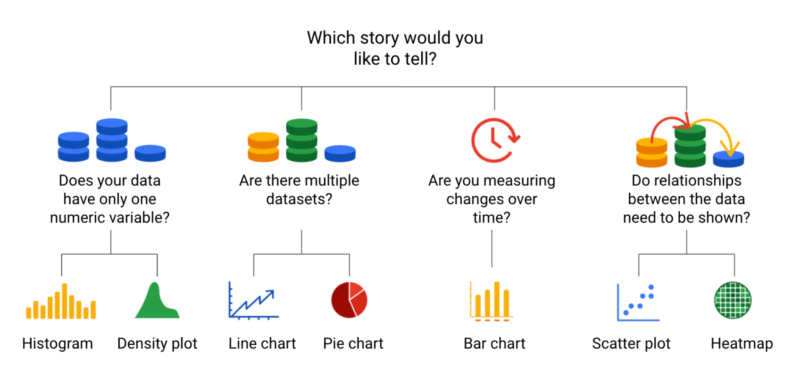

# Data visualization types

Meaningful patterns can take many forms, such as:

- **Change**: This is a trend or instance of observations that become different over time. A great way to measure change in data is through a **line or column chart**.

- **Clustering**: A collection of data points with similar or different values. This is best represented through a **distribution graph**.

- **Relativity**: These are observations considered in relation or in proportion to something else. You have probably seen examples of relativity data in a **pie chart**.

- **Ranking**: This is a position in a scale of achievement or status. Data that requires ranking is best represented by a **column chart**.

- **Correlation**: This shows a mutual relationship or connection between two or more things. **A scatter plot** is an excellent way to represent this type of data pattern.

## Line chart

A line chart is used to **track changes over short and long periods of time**.

When smaller changes exist, line charts are better to use than bar graphs.

Line charts can also be used to **compare changes over the same period of time for more than one group**.

## Column chart

Column charts use size to **contrast and compare two or more values**, using height or lengths to represent the specific values.

## Heatmap

Similar to bar charts, heatmaps also use color to compare categories in a data set.

They are mainly used to **show relationships between two variables** and use a system of color-coding to represent different values.

## Pie chart

The pie chart is a circular graph that is divided into segments **representing proportions** corresponding to the quantity it represents, especially when **dealing with parts of a whole**.

## Scatter plot

Scatter plots **show relationships between different variables**.

Scatter plots are typically used for two variables for a set of data, although additional variables can be displayed.

## Distribution graph

A distribution graph displays **the spread of various outcomes** in a dataset.

If outcomes are categorized on the x-axis by **distinct numeric values (or ranges of numeric values)**, the distribution becomes a **histogram**. It's a chart that shows **how often data values fall into certain ranges**.

## Decision trees

A decision tree is a decision-making tool that allows you, the data analyst, to make decisions based on key questions that you can ask yourself.

