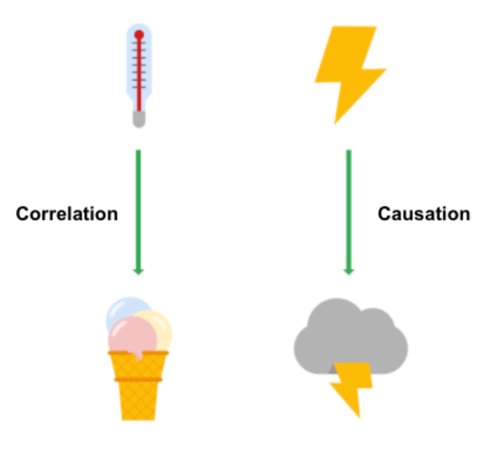

## Understand Data Visualization

### Frameworks

Frameworks can help you organize your thoughts about data visualization and give you a useful checklist to reference.

#### The McCandless Method

- **Information**: the **data** you are working with

- **Story**: a clear and compelling **narrative or concept**

- **Goal**: a specific **objective or function** for the visual

- **Visual form**: an effective use of **metaphor or visual expression**

All four elements need to be at work to create an effective visual.

#### Kaiser Fung’s Junk Charts Trifecta Checkup

This approach is a useful set of questions that can help consumers of data visualization critique what they are consuming and determine how effective it is. The Checkup has three question:

- What is the practical question?
- What does the data say?
- What does the visual say?

This checklist helps you think about your data viz from **the perspective of your audience** and decide if your visual is communicating your data effectively to them or not.

### Pre-attentive attributes

Pre-attentive attributes are the elements of a data visualization that people recognize automatically **without conscious effort**.

The essential, basic building blocks that make visuals immediately understandable are called **marks and channels**.

#### Marks

M​arks are basic visual objects like **points, lines, and shapes**. Every mark can be broken down into four qualities:

1. **Position** - Where a specific mark is in space in relation to a scale or to other marks

2. **Size** - How big, small, long, or tall a mark is

3. **Shape** - Whether a specific object is given a shape that communicates something about it

4. **Color** - What color the mark is

#### Channels

C​hannels are visual aspects or variables that represent characteristics of the data. Channels will vary in terms of how effective they are at communicating data based on three elements:

1. **Accuracy** - Are the channels helpful in accurately estimating the values being represented?

2. **Popout** - How easy is it to distinguish certain values from others?

3. **Grouping** - How good is a channel at communicating groups that exist in the data?

### Design principles

| Principle                   | Description                                                                                                                                                     |
| --------------------------- | --------------------------------------------------------------------------------------------------------------------------------------------------------------- |
| Choose the right visual     | Visual will be the **most effective for your audience**.                                                                                                        |
| Optimize the data-ink ratio | Try to **minimize non-data ink** like boxes around legends or shadows to optimize the data-ink ratio.                                                           |
| Use orientation effectively | You can change the orientation of your visual to make labels **easier to read and understand**.                                                                 |
| Color                       | Using color **consciously and meaningfully**, **staying consistent throughout your visuals**.                                                                   |
| Numbers of things           | If your visualization uses lines, try to plot **five or fewer**. When using visuals like pie charts, try to keep the number of segments to **less than seven**. |

### Correlation vs. Causation

- **Correlation** in statistics is the measure of the degree to which two variables move in relationship to each other.

  It is important to remember that correlation doesn’t mean that one event causes another. But, it does indicate that they have a pattern with or a relationship to each other.

- **Causation** refers to the idea that an event leads to a specific outcome.

