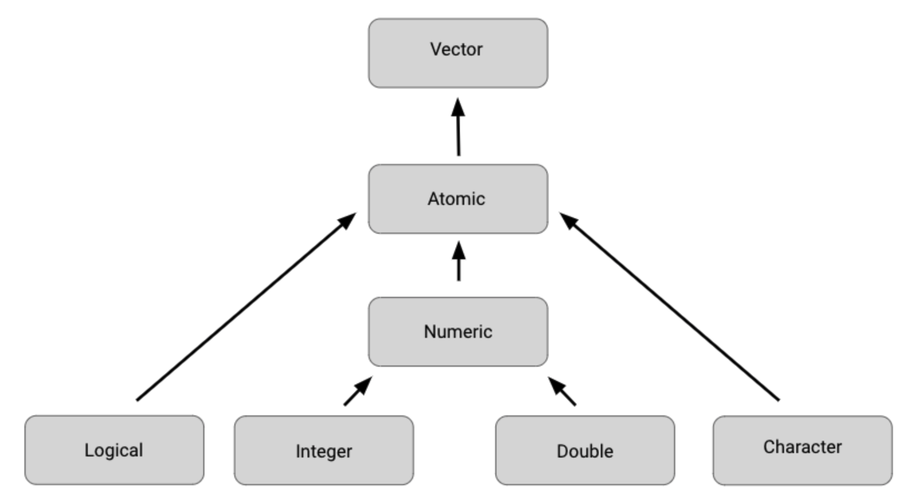

# R Basic types

- Function:

  Functions are a body of reusable code used to perform specific tasks in R.

  Tpying `?` before a function can show the documents of the function. i.e. `?print()`

- Variable:

  A variable is a representation of a value in R that can be stored for use later during programming.

  Variables can also be called **objects**.

  A variable name should **start with a letter** and can also contain **numbers and underscores**.

- Comment:

  A comment must start with `#`.

- Data Type:

  There are number, string, date, datetime, etc. To asign a data to a variable:

  ```r
  first_var <- "test"
  ```

- Vector:

  A vector is a **group of data elements** of **the same type** stored in a **sequence** in R.

  ```r
  vec_1 <- c(1, 2, 3)
  ```

- Pipe:

  A pipe is a tool in R for expressing a sequence of multiple operations.

## Atomic vectors

A vector that contains **ONLY ONE** type of data.



To create a vector:

- double vector: `c(2.5, 48.5, 101.5)`
- integer vector: `c(1L, 5L, 15L)`
- character vector: `c(“Sara” , “Lisa” , “Anna”)`
- logical vector: `c(TRUE, FALSE, TRUE)`

### Naming vectors

```r
x <- c(1, 3, 5)
names(x) <- c("a", "b", "c")
```

Now, R shows that the first element of the vector is named `a`, the second `b`, and the third `c`.

## List

Lists are different from atomic vectors because their elements can be of **any type**.

### Determining the structure of lists

`str()` shows the structure of a list.

### Naming lists

```r
list('Chicago' = 1, 'New York' = 2, 'Los Angeles' = 3)
```

## Dates and times in R

In R, there are three types of data that refer to an instant in time:

- A date: `2016-08-16`
- A time within a day: `20:11:59 UTC`
- a datetime: `2018-03-31 18:15:48 UTC`

To get current date and datetime:

- `today()`: current date

- `now()`: current datetime

Converting from strings:

- `ymd("2021-01-20")`
- `ymd_hms("2021-01-20 20:11:59")`

## Data frames

Data frames are the most common way of storing and analyzing data in R.

A data frame is a collection of columns–similar to a spreadsheet or SQL table.

There are a few key things to keep in mind when you are working with data frames:

- Columns should be named.
- Data frames can include many different types of data, like numeric, logical, or character.
- Elements in the same column should be of the same type.

## Files

- `dir.create` function to create a new folder
- `file.create` function to create a new file
- `file.copy` function to copy a file to the destination
- `unlink` function to delete a file

## Matrix

A matrix is a two-dimensional collection of data elements.

- `matrix(c(3:8), nrow = 2)`:

  ```
  3 4 5
  6 7 8
  ```

- `matrix(c(3:8), ncol = 2)`:

  ```
  3 6
  4 7
  5 8
  ```
