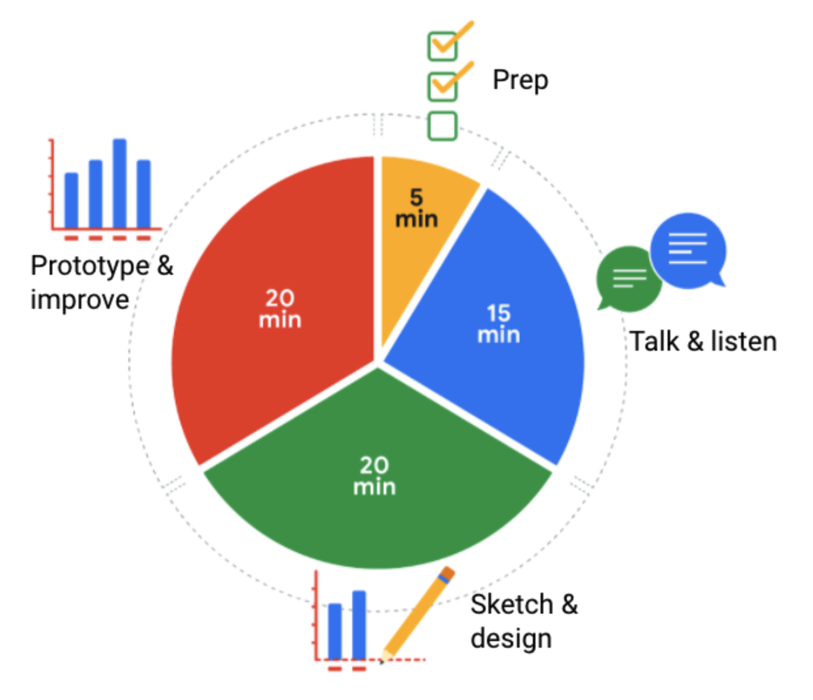

# Design

## The element of Art

- **Line**

  They can add visual form to your data and help build a structure for your visualization.

- **Shape**

  Shapes are also known for their **variety**.

  Shapes are also a great way to add eye-catching contrast, especially size contrast to your data story.

- **Color**

  It's a very effective way to draw our audience's attention to specific areas.

  - Hue: color, such as red, blue, green, etc
  - Intensity: how bright or dull the color is
  - Value: the lightness or darkness

- **Space**

- **Movement**

  Movement is used to create a sense of flow or action in a visualization.

## Principles of design

There are nine basic principles of design that data analysts should think about when building their visualizations.

1. Balance
2. Emphasis
3. Movement
4. Pattern
5. Repetition
6. Proportion
7. Rhythm
8. Variety
9. Unity

These first six principles of design are key considerations that you can make while you are creating your data visualization. These next three principles are useful checks once your data visualization is finished.

### Balance

The design of a data visualization is balanced when the key visual elements, like color and shape, are **distributed evenly**.

If your data visualization is balanced, this could mean that the lines used to create the graphics are **similar in length on both sides**, or that **the space between objects is equal**.

Your visualization shouldn’t have one side distracting from the other.

### Emphasis

Your data visualization should have **a focal point**, so that your audience knows where to **concentrate**.

Using **color and value** is one effective way to make this happen.

### Movement

Movement can refer to the path the **viewer’s eye travels** as they look at a data visualization, or literal movement created by **animations**.

You can use **lines and colors** to pull the viewer’s attention across the page.

### Pattern

You can use **similar shapes and colors** to create patterns in your data visualization.

You can use patterns to **highlight similarities** between different data sets, or break up a pattern with a unique shape, color, or line to **create more emphasis**.

### Repetition

Repeating chart types, shapes, or colors adds to the **effectiveness** of your visualization.

### Proportion

Proportion is another way that you can **demonstrate the importance of certain data**.

Using various **colors and sizes** helps demonstrate that you are calling attention to a specific visual over others.

### Rhythm

This refers to **creating a sense of movement or flow** in your visualization.

Rhythm is closely tied to the movement principle.

### Variety

Your visualizations should have some variety in the chart types, lines, shapes, colors, and values you use.

Variety keeps the audience engaged. But it is good to find balance since too much variety can confuse people.

### Unity

This means that your final data visualization should be **cohesive**.

If the visual is disjointed or not well organized, it will be confusing and overwhelming.

## Element for effective visuals

- Clear meaning

  Good visualizations **clearly communicate their intended insight**.

- Sophisticated use of contrast

  It helps **separate the most important data from the rest** using visual context

- Refined execution

  Visuals with refined execution include **deep attention to detail**, using all the elements of art.

## Design thinking

Design thinking is a process used to solve complex problems in a **user-centric** way.

Design thinking for data visualization involves five phases:

- **Empathize**: Thinking about the emotions and needs of the target audience for the data visualization

- **Define**: Figuring out exactly what your audience needs from the data

- **Ideate**: Generating ideas for data visualization

- **Prototype**: Putting visualizations together for testing and feedback

- **Test**: Showing prototype visualizations to people before stakeholders see them

## Designing a chart in 60 minutes

- **Prep (5 min)**: Create the mental and physical space necessary for an environment of comprehensive thinking.

- **Talk and listen (15 min)**: Identify the object of your work by getting to the “ask behind the ask” and establishing expectations.

- **Sketch and design (20 min)**: Draft your approach to the problem. Define the timing and output of your work to get a clear and concise idea of what you are crafting.

- **Prototype and improve (20 min)**: Generate a visual solution and gauge its effectiveness at accurately communicating your data. Take your time and repeat the process until a final visual is produced. It is alright if you go through several visuals until you find the perfect fit.
