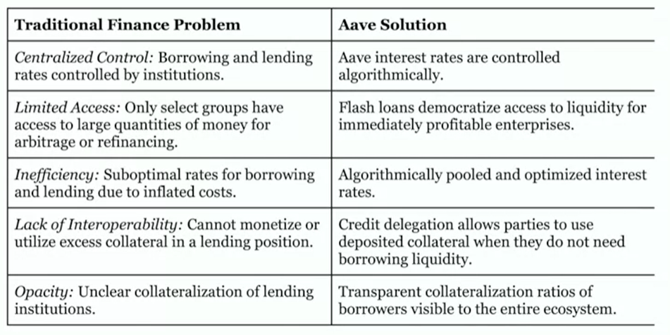

# Aave

Aave is similar to [Compound](./compound.md).

It has **more tokens to supply and borrow**, and the **borrow interest rate is more predictable**.

## Refinance

Aave provides **flash loan** (the loan without the collateralization since it's paied at the time is borrowed).

With the flash loan, we are able to switch from the protocol with higher borrow rate (Compound 15%) to a lower one (Aave 5%).

## Stable loan

Stable loan rate is an Aave innovation. It's not fixed, but it's relatively stable compared to other protocols.

**Borrow rate** can be a stable rate, but supply rate can't, it's always variable.

## Credit delegation

Credit delegation can **allocate collateral to potential borrowers** who can use it to borrow an asset.

The process is **not secured** and relied on **trust**. It allows for uncollateralized relationship.

It's another way, besides flash loan, to borrow a loan without the collateral (e.g. ETH).

## Summary

Aave provides:

- Stable loan rate for borrowers

- flash loan

  It attracts arbitrageurs and other applications that require **flash liquidity**.

  It offers extra returns to suppliers.

- Credit delegation

  It allows loan without the collateral. The user with NFTs can borrow loan, too.

## Solution

