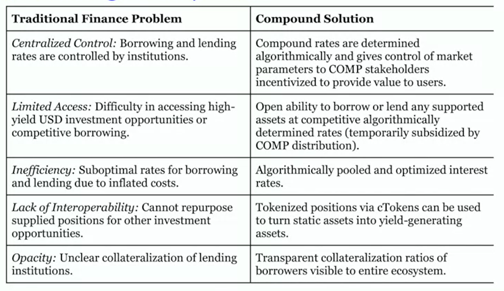

# Compound

Compound offers **different ERC-20 tokens**.

All the tokens are pooled together, so that every lender earns the same variable rate and all the borrower pays the same variable rate.

## Overcollateralization

Since the ETH and ERC-20 tokens are not stable. They are overcollateralized as what we do in [MakerDAO](./makerDAO.md).

## Collateralization ratios and factor

Different token has different collateralization factor in compound. And:

```
Ratio = 100 / factor
```

Volatile assets generally have lower collateral ratio.

Therefore, the power of compound is to **mix the assets with different volatilities** to get **the max total borrow liquidity**. For example, 80% of ETH (factor is 60) and 20% of DAI (factor is 90).

## Supply and Borrow

The supply and borrow interest rates

- are compounded every block
- are determined by the **utilization percentage** in the market

The utilization percentage is **total borrow/total supply**. It's one the parameters that determines the **interest rates**. Others are set by **Compound Governance**.

### Borrow interest rate

```
rate = slop * x + base rate
```

- slop: It represents the rate of change of the rate.

### Supply interest rate

```
rate = borrow interest rate * utilization ratio
```

## cToken

cToken represents the **share of pool** after you deposit your assets in a pool.

cToken is collateralized by the pool. It's valuable. It can be traded.

## Solution


