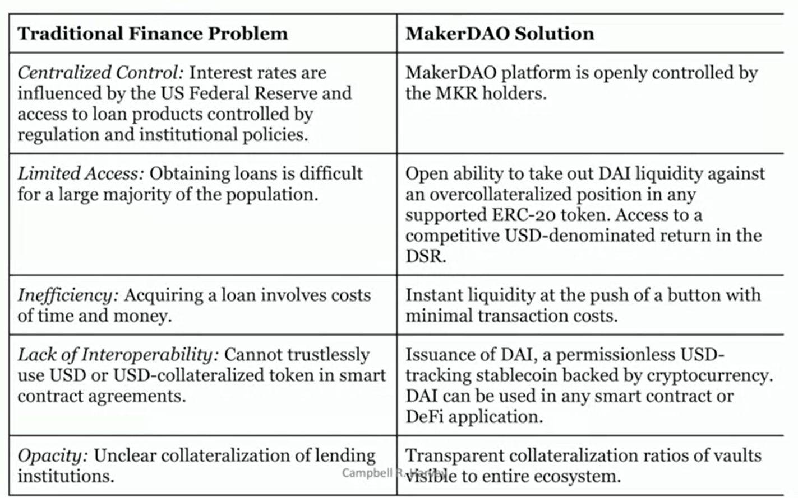

# MakerDAO

MakerDAO creates **crypto-collateralized stablecoin**, DAI. It runs without outside centralized institutions, such as vaulting, auditing.

They have 2 tokens:

- DAI: stablecoin
- MKR: governance token

## Mechanics of DAI

1. A user deposits **ETH or ERC-20** token to a **Vault**.

   Vault is a smart contract that **escrows collateral** and keep tracks of the **USD-denominated value** of it.

2. The user can **mint DAI** depended on his assets. This creates a "debt" in DAI that must be paid back by the Vault holder.

3. The user can use DAI for whatever he wants, like exchanging for cash, buying more ETH, etc.

Because ETH is more volatile DAI, we need **over-collateral**.

What's more, we don't mint DAI to the max. We have a **buffer** to avoid being liquidated if the value of ETH drops.

## Liquidation

If the value of collateral, e.g. ETH, is going **down**, the vault holder faces 3 scenarios.

- He can **increase the amount of collateral**. e.g. add 1 ETH.
- He can use DAI to **pay back the loan**, and **retrieve the collateral**.
- The loan is **liquidated by the keeper** (external actor).

  The keeper **pays off the loan** in ETH, and he get the **incentive fee** in ETH.

## Stability of DAI

The forces to keep DAI stable are:

1. Overcollateralization
2. Market actions

   In the liquidation, ETH are sold to buy DAI.

### Stability fee

It's a **variable interest rate** paid by **vault holder** on **DAI debt** they generate.

It controls the **generation or repayment** of DAI to keep its price to the peg (which is USD).

### DAI Savings Rate (DSR)

It's a **variable rate** that DAI holder can earn on their DAI deposit.

Stability fee is always **greater than or equal to** DSR.

### DAI Debt Celling

There is a **max limit on DAI supply**.

Some of parameters can't be changed, while others can be changed by using governance token.

### Large drop of the value of collateral

If the collateral drops that the DAI debt can't be fully repaid, the position is closed. The protocol accrues what is call **protocol debt**.

There is a **buffer pool** of DAI that covers **protocol debt**.

If **buffer pool** can't cover it, then we need **governance token** and **governance system** to solve it.

## Governance

The MKR token controls MakerDAO. With MKR tokens, we can change the parameters of DAI, doing the right things to make MakerDAO better.

As we discussed before, MakerDAO has serveral levels to protect DAI value.

1. overcollateralization
2. stability (stability fee, DSR, DAI Debt Celling, buffer pool)

If these 2 levels are broken, and the value of DAI keeps dropping, it reaches the third level, global settlement.

### Global settlement

We mint more MKR tokens to inflate it, and let more investors in.

## Riskes

- DAI supply is highly depended on ETH-collateralization.
- No clear arbitrage loop.

  For example, Coinbase makes sure that you can get $1 by selling 1 USDC. It's not for DAI since it's collatered on ETH.

## Solution to the current problem

Let's see what kinds of the problem that MakerDAO solves.

