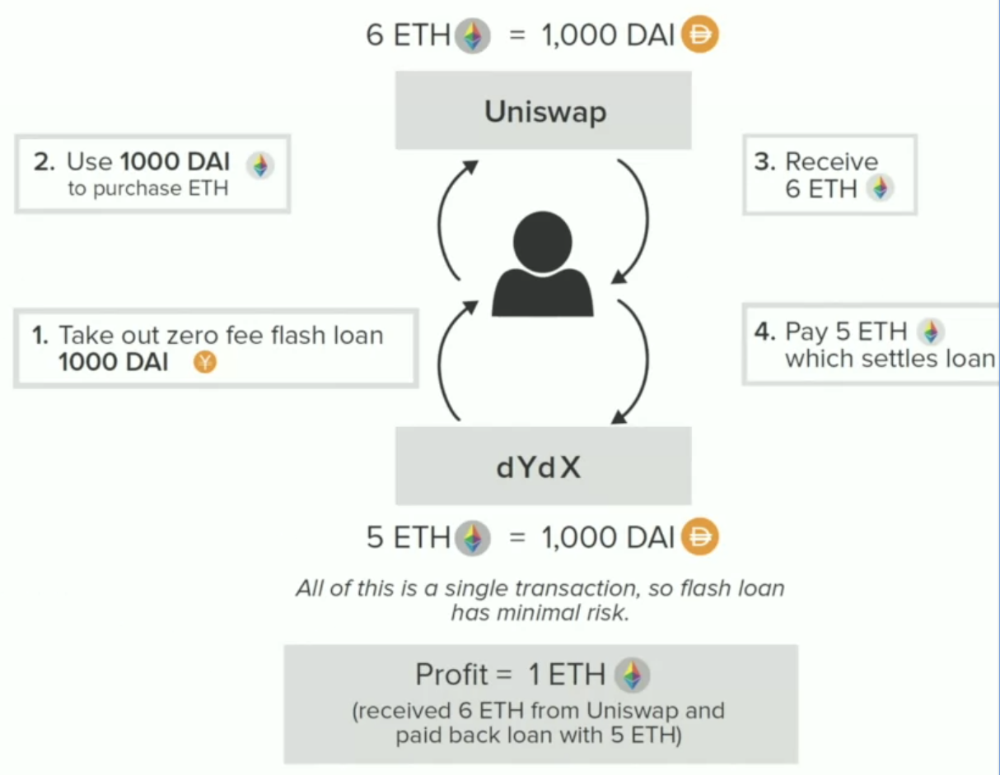

# dYdX

dYdX is a company that specializes in **margin trading** and **derivatives**.

The DEX use **hybrid on-off chain approach**. It keeps signed of pre-approved order without submitting to Ethereum.

Therefore, the orders are used to exchange fund for the **desired asset** at the **desired price**. The DEX supports **limited orders** and **maximum slippage** parameters for market orders.

## Flash loans

Flash loans are **free** in dYdX.

Flash loans are very important for **arbitrage**. For example:

## Perpetual Futures

Perpetual futures are similar to traditional **futures but without a settlement date**. The investors is simply betting on the future picture of the asset.

The contract can be **long or short**, with or without **leverage**.

If the collateral is below the margin (e.g. 10% of asset), keeps come in and liquidate us (take all the rest of our money).

### Traditional futures

Future is to buy/sell(long/short) the asset in future.

For example, we want to make a **long future**. We don't have enough money to buy an asset. So we deposit **10% of the collateral** to buy the long future.

If the price goes up in the future, we win. If it goes down, we lose. If it goes down more than **10%**, we are **liquidated**.

### Future funding rate

Future funding rate keeps the future price to the index. It lets **one side pay another**.

- Trading at premium:

  Future funding rate is positive. Long pays short.

- Trading at discount:

  Future funding rate is negative. Short pays long.

## Solution

