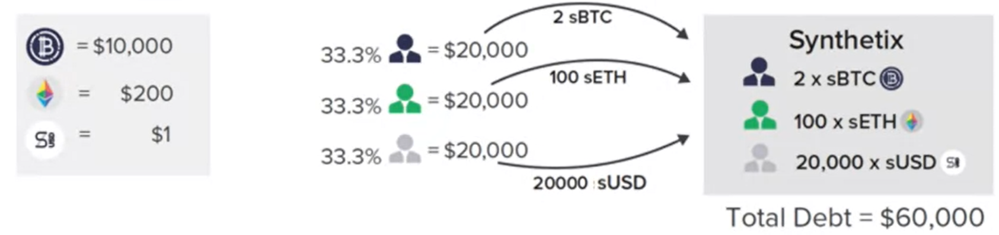
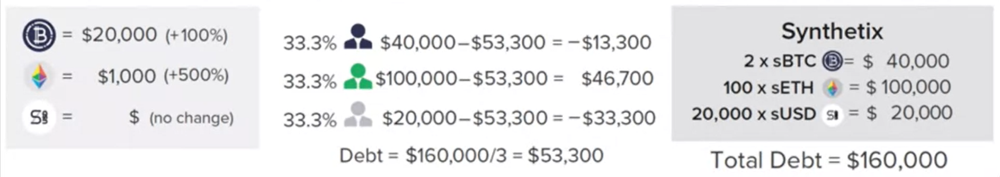
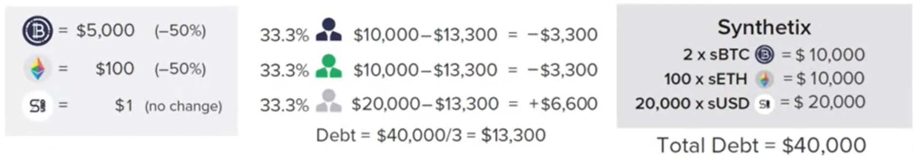
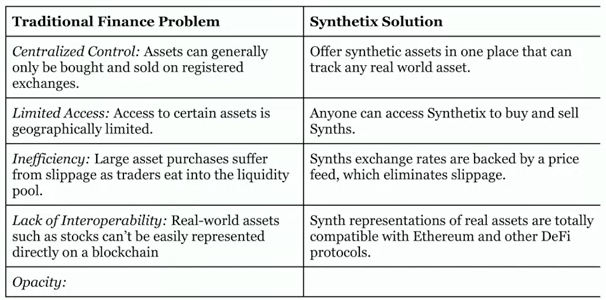

# Synthetix

Synthetix creates the **derivative assets** whose value is based on underlying assets that are **neither owned nor escrowed**.

It tracks the assets:

- cypto currency: sBTC, sETH, ...
- fiat currency: sUSD, sEUR, ...
- equity (stock): sFB (facebook), sGOOG (google), ...
- commodity: sXAU (gold), sOIL, ...

## Synthetix token

A long Synth is called **sToken**. e.g. `sOIL`.

A short Synth is called **iToken**. e.g. `iOIL`.

## Synthetix platform token (SNX)

SNX is the **untility token**. It serves as the unique collateral asset for the entire system.

## Mechanics

For example, there are 3 traders have $20,000.

- One holds 2 sBTC.
- One holds 100 sETH.
- One holds 20,000 sUSD.

The total debt is **$60,000**. Each of them has **33% of the share of the entire pool**.

If BTC **goes up 100%** and ETH **goes up 500%**.

The total debt is **$160,000**. Each of them has **$160,000 / 3 = $53,300**.

Therefore, only sETH holder wins.

If BTC **goes down 50%** and ETH **goes down 50%**.

The total debt is **$40,000**. Each of them has **$40,000 / 3 = $13,300**.

In this case, sUSD holder wins.

## Solution

