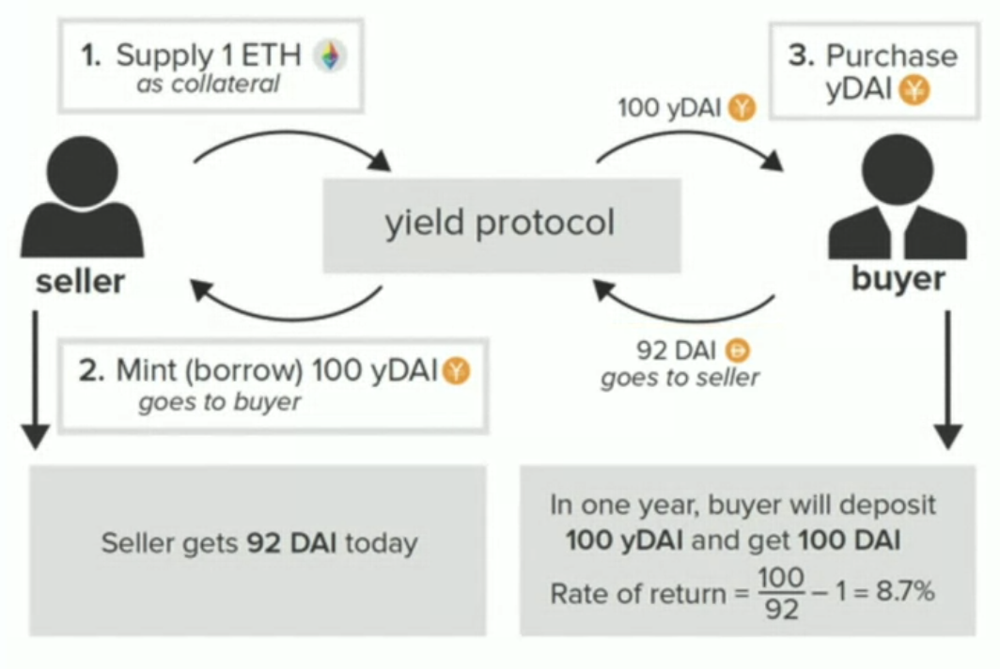
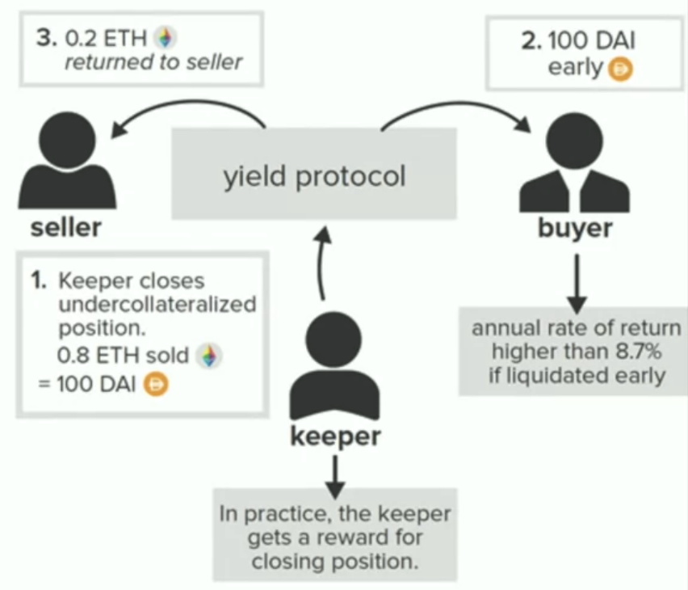
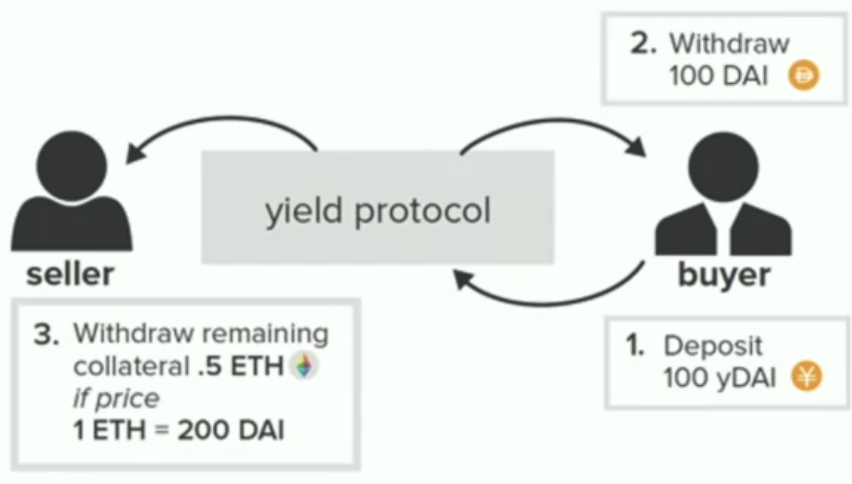
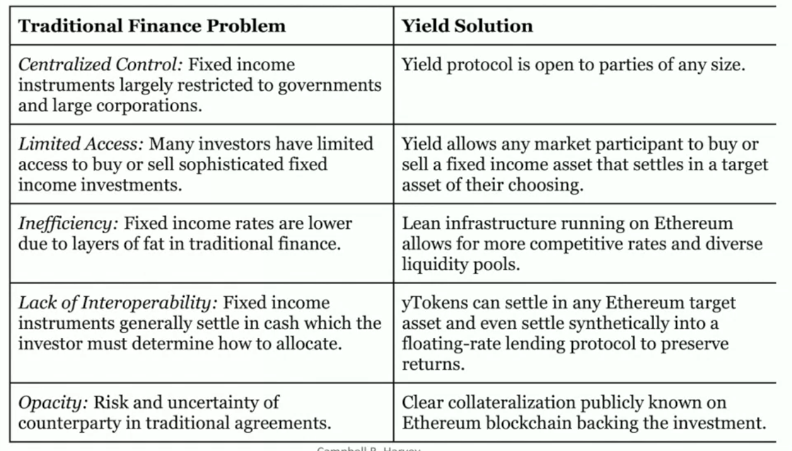

# Yield protocol

It proposes a derivative model for secured, zero-coupon bonds. This enables **fixed borrowing rate**.

## Prerequisite

As other DeFi protocols, it needs **overcollaternal**. If the collaternal's value goes collaternalization requirement, **keeps** will come in and liquidate.

## Mechanics

Let's see how Yield protocol keeps a **fixed borrowing rate**.

For example, we have `1 ETH = 200 DAI`. Yield protocol has a fixed borrowing rate `8.7%`.

If the price of ETH drops, the keep come in to close undercollateralized position.

The buyer gets the payback early. The seller gets 92 DAI and 0.2 ETH.

If the price of ETH goes up. The buyer still gets 100 DAI in time, while the seller get 0.5 ETH and 92 DAI.

As we can see, buyer always gets 100 DAI, while seller's payback depends on ETH price.

## Solution

