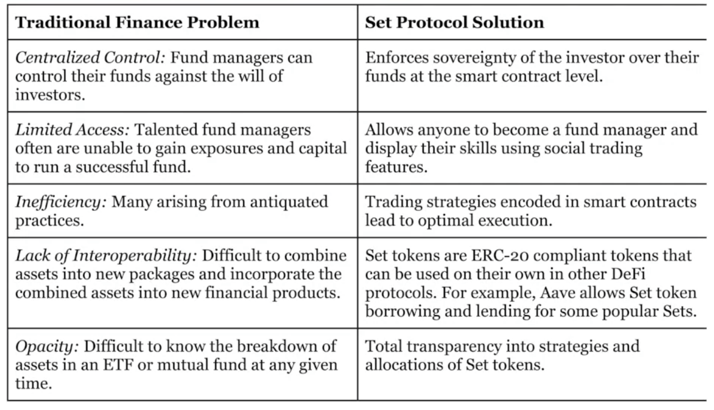

# Set Protocol

## Tokenization

Tokenization refers to the process of **taking some assets**, either on or off chain to:

1. represent asset on chain with **fractional ownership**
2. create a composite token that holds some number of underlying tokens.

## Set

Set offers the "composite" token approach to tokenization.

### Static Set

Static set is a **bunlded token**. It can be transferred as a single unit.

## Dynamic Set

Dynamic set defines a **trading strategy** that determines when reallocations can be made and at what times.

Similar to normal ETFs, these set tokens have **fees** and sometimes **performance-related incentives**.

## Solution

