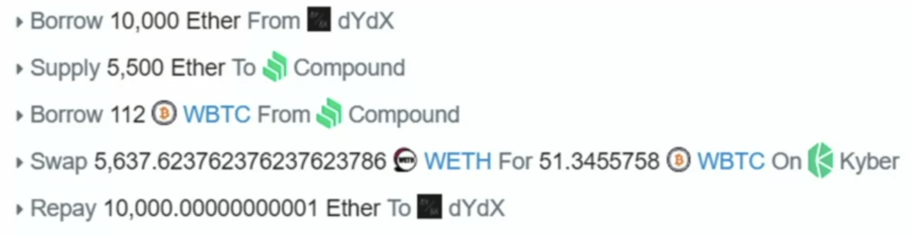

# Smart contrat risk

Since the smart contrat is open, everyone can read it. That also means everyone can attack its weak points.

There are 2 main types of exploits:

- Logic Exploits:

  It's caused by the error in the smart contrat codes.

  An example of a smart contract logic error is rounding.

  Suppose the contract has 3.9999999999990 ETH and the payout is rounded to 4 ETH. The transaction will fail because the contract does not have 4 ETH.

  In DeFi ecosystem, there are DAO to **audit** smart contrats to prevent this type of exploits.

- Economic Exploits:

  It's the most common error. The attacks use the different asset prices on different platforms to make money, similar to **arbitrage**. (e.g. flash attack)

  

  An example of an economic exploit is the exchange between two tokens when the price is linked via an oracle to an illiquid exchange. The exploiter can **attack the oracle exchange** and **manipulate the price**.

- Rug pull:

  The original developers (the major token owners) sell everything when the price of the token is high. This action will cause the price dropping near to zero.
