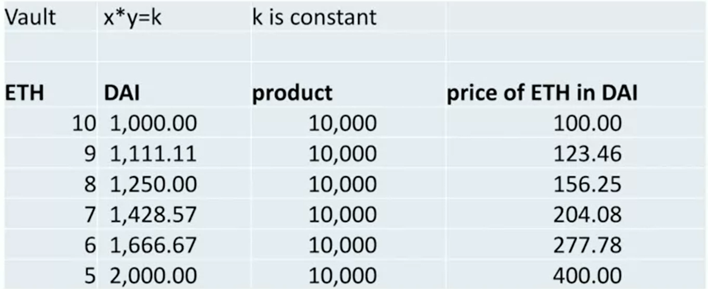

# Swap

A swap is **the exchange from one type of token to another**.

## Centralized exchange

Using Coinbase or other platforms to do the exchange is centralized.

It's easy to fake the volumne in centralized exchange (e.g. transfering the tokens between your two wallets).

There are some key elements to look at.

- **order book**:

  List of trades (size and price) that have been submitted but not yet filled.

  The volumn of most of the trades should be **small**. The distribution should be **similar daily**.

- **Spread**:

  The difference between the current market price for that asset and the price you buy or sell that asset for.

  It should be **low**.

## Decentralized Exchange (DEX)

The swap only executes when the exchange conditions are agreed and met by **all the parties**, and enforced by the **smart contract**.

The most popular mechanism for **DEX liquidity** is Automated Market Makers.

### Automated Market Makers (AMM)

AMM is a smart contract that **holds assets** on **both sides** of a trading pairs, and it **continuously quotes a price** for buying and selling.

Based on executed **buys and sells**, the contract updates **asset size** and uses this ratio to define **pricing function**.

### Naive AMM

The price ratio is fixed between 2 assets.

It's naive because we can buy a token at a low price and exchange ETH. We should have a **pricing function** to avoid that.

### Uniswap V2

Uniswap comes up a solution. They set the **the product of the volumn of 2 assets in an AMM to be constant.**

For example, if the AMM is initialized with 10 ETH and 1000 DAI. the product of the volumn in this AMM always remains **10 \* 1000**.

This prevents the people to withdraw all ETH when the price ETH goes high.

## Impermanent loss

It's possible we lose value temporarily when we put them in AMM.

For example, we put **100 token A and 100 token B** in an AMM, Both 1 A and 1 B worths 1 ETH.

After a while, 1 A worths 2 ETH and 1 B worths 4 ETH. But the trader exchanges A for B. Now the AMM has **200 token A and 0 token B**.

Now, the AMM worths 400 ETH. But if we don't put any token in the AMM, we have 600 ETH worthed token (100 token A and 100 token B).

That's the impermanent loss. It's impermanent because the loss can be covered when the price of A comes up.

It turns out that the most attractive pairs to have for AMM are pairs that have **correlated prices**, so you don't see a lot of deviation , so-called **mean-reverting pairs**. **Stablecoin pairs** are very attractive for AMMs because the impermanent loss is very small.
