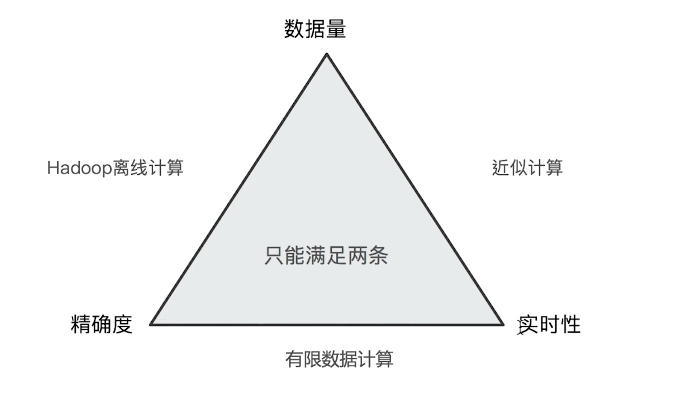

# Aggregation

Aggregation is an **attribute** of Search API.

```json
POST employees/_search
{
    "size": 0 // Since we don't need the items
    "aggs": {
        "max_salary": {
            "max": {
                "field": "salary"
            }
        },
        "min_salary": {
            "min": {
                "field": "salary"
            }
        },
    }
}
```

## Bucket

It can split the data into different buckets

```json
POST employee/_search
{
    "size": 0,
    "aggs": {
        "age_buckets": {
            "terms": {
                "field": "age",
                "size": 3
            }
        }
    }
}
```

## Nested aggregation

We can put an aggregation under another one.

```json
POST employees/_search
{
    "size": 0 // Since we don't need the items
    "aggs": {
        "job_buckets": {
            "terms": {
                "fields": "job.keyword"
            },
            "aggs": {
                "senior_employees": {
                    "top_hits": {
                        "size": 3,
                        "sort": [
                            {
                                "age": {
                                    "order": "desc"
                                }
                            }
                        ]
                    }
                }
            }
        }
    }
}
```

## Pipeline aggregation

Apply functions on the results of aggregation.

```json
POST employees/_search
{
    "size": 0 // Since we don't need the items
    "aggs": {
        "jobs": {
            "terms": {
                "fields": "job.keyword"
            },
            "aggs": {
                "avg_salary": {
                    "avg": {
                        "field": "salary"
                    }
                }
            }
        },
        "min_salary_by_jobs": {
            "min_bucket": { // pipeline function
                "bucket_path": "jobs>avg_salary" // bucket_path indicates it's a pipeline aggregation
            }
        }
    }
}
```

## Query + Aggregation

`Query` gives a **range** for aggregation result.

```json
POST employees/_search
{
    "size": 0,
    "query": { // the employee should be over 30 years old.
        "range": {
            "age": {
                "gte": 30
            }
        }
    },
    "aggs": {
        "max_salary": {
            "max": {
                "field": "salary"
            }
        },
        "all": {
            "global": {} // It overrides the query range.
            "aggs": {
                "max_salary": {
                    "max": {
                        "field": "salary"
                    }
                }
            }
        }
    }
}
```

## Performance



- If the data size is small, ES works very good.

- If the data size is big, ES will share the data on different shards, and the **precision** goes down.

To improve the it, there are 2 ways:

- put all the data in **one primary size**.

- increase the `shard_size` in the term aggregation.

The terms aggregation fetches more than the top size terms from each shard. It fetches the top shard_size terms, which defaults to size \* 1.5 + 10.

```json
{
  "size": 0,
  "aggs": {
    "<a-name>": {
      "terms": {
        "field": "someKeyword",
        "size": 3,
        "shard_size": 10 // the size of data the ES will fetch on each shard
      }
    }
  }
}
```
