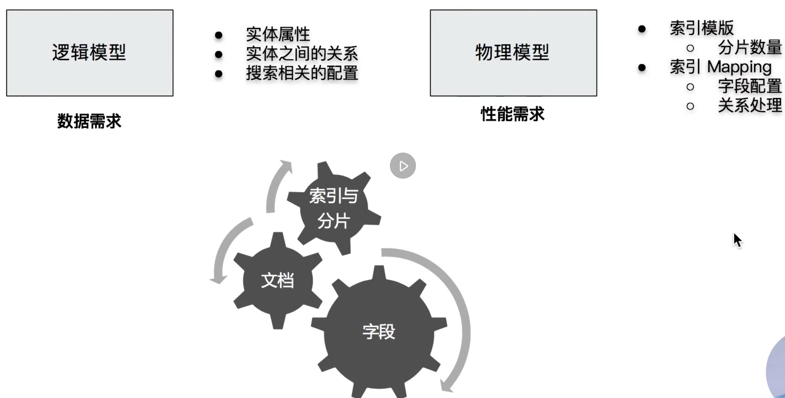

# Data Modeling

Data modeling must take the following aspects into the consideration.

- Functional needs
- Performance needs

## Field modeling

We need to think about:

1. **Type** of the field
2. If it needs to be **searched** or **tokenized**
3. If it needs to be **aggregated** or **sorted**
4. If it needs the **extra storage**

(More mapping parameters are presented [here](https://www.elastic.co/guide/en/elasticsearch/reference/7.17/mapping-params.html).)

### Type: Text vs Keyword

Text:

- It can be **searched**, and be **tokenized**
- It won't be **aggregated** unless we set `fielddata` to `true`

Keyword:

- It's won't be **tokenized**, it's useful for **ID** (email, phone number, etc)

- It's used for **Filtering**, **Sorting**, and **Aggregation**.

By default, the context will be set as `text` and have a sub type as `keyword`

### Needs for searching

- If there is no needs for **searching**, **sorting**, and **aggregation**, set `enabled` to `false`.

- If no needs for search, set `index` to `false`

- If no needs for aggregation or sorting, set `doc_values` and `fielddata` to `false`

### Extra storage

We can set `store` to `true`.

But, it's used when `_source`'s `enabled: false`.

> Attention: if `_source`'s `enable: false`, we can't reindex or update

Since the `_source`'s `enabled: false`, we can't get the content by using `_search` API. We need to add `stored_fields` in the request. (`store: true`)
