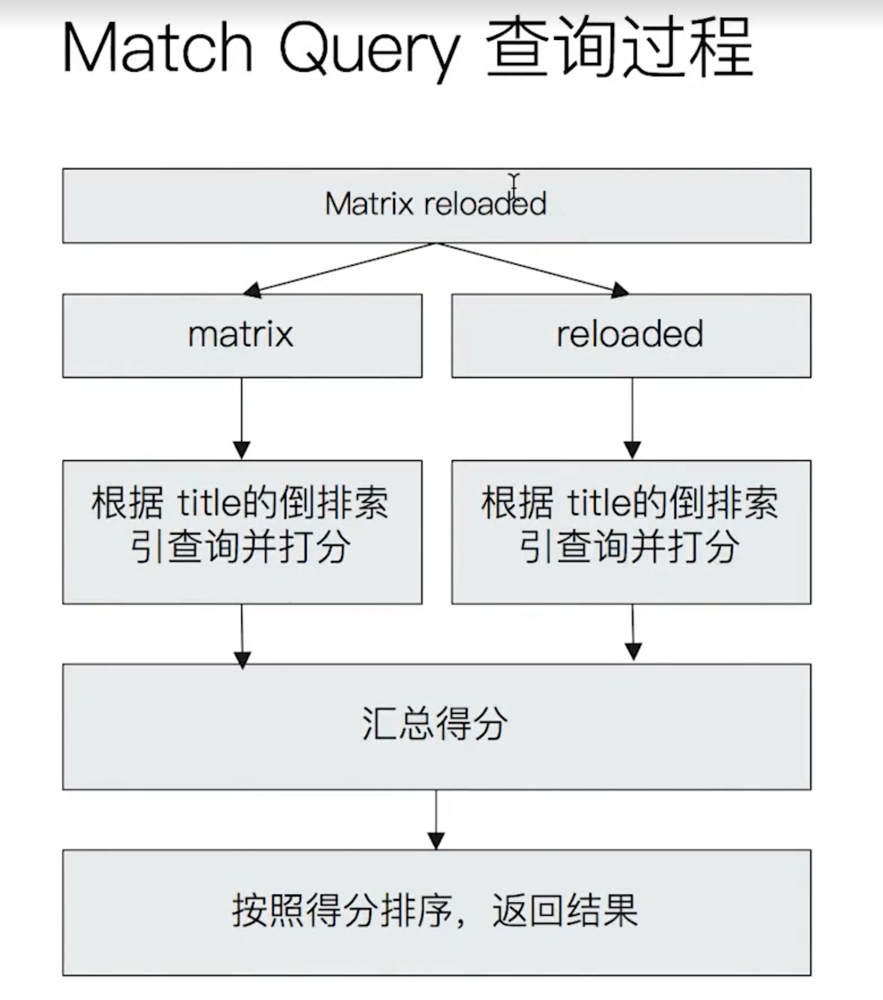
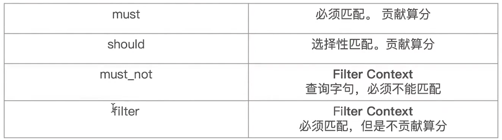

# Search

## Term search & Constant Score

Term is the **minimum unit** of the context.

ES will **not tokenize** term during the search.

For example, there are 3 indexes.

```json
POST /products/_bulk
{ "index": {"_id" : 1} }
{ "uid" : "QWE-2-OPJP", "name" : "iPhone" }
{ "index": {"_id" : 2} }
{ "uid" : "KHK-4-YNUI", "name" : "iPad" }
{ "index": {"_id" : 3} }
{ "uid" : "TUB-9-TYBUD", "name" : "Apple watch" }
```

And we term query the `name`.

```json
POST /products/_search
{
  "query": {
    "term": {
      "name": {
        // "value": "iPhone" Don't work since indexing has tokenized the word, and term search doesn't
        "value": "iphone"
      }
    }
  }
}
```

Since term search doesn't tokenize, we should search the **keyword**.

```json
POST /products/_search
{
  "query": {
    "term": {
      "name.keyword": {
        "value": "iPhone"
      }
    }
  }
}
```

Besides, **term search** supports **prefix search**, **wildcard search\***, **range query**, **exists query**.

```json
POST /products/_search
{
  "query": {
    "term": {
      "uid": {
        "value": "qwe"
      }
    }
  }
}
```

Sometime, we **don't need the score**, we can use **constance score** to let ES stop using `query `. Instead, ES will use the `filter` which applies the **cache** to improve the performance.

```json
POST /products/_search
{
  "query": {
    "constant_score": {
      "filter": {
        "term": {
          "name.keyword": "iPhone"
        }
      }
    }
  }
}
```

## Match Query



## Bool Query

- Query: calculate the score
- Filter: do NOT calculate the score



```json
POST /products/_search
{
  "query": {
    "bool": {
      "must": [
        {
          "range": {
            "price": {
              "gte": 500
            }
          }
        }
      ],
      "should": [
        {
          "term": {
            "name.keyword": {
              "value": "iPhone"
            }
          }
        },
        {
          "term": {
            "name.keyword": {
              "value": "iPad"
            }
          }
        }
      ],
      "minimum_should_match": 1
    }
  }
}
```

The body can be **nested**. The level indicates the **priority**.

## Boosting query

`boosting` controls the **weight** of the term.

- `> 1`: positive impact, increase the weight
- `0 - 1`: positive impact, decrease the weight
- `< 0`: negative impact

For example, query the product of Apple, not the apple food.

```json
POST /products/_search
{
  "query": {
    "boosting": {
      "positive": {
        "match": {
          "context": "apple"
        }
      },
      "negative": {
        "context": "pie"
      },
      "negative_boost": 0.2
    }
  }
}
```
