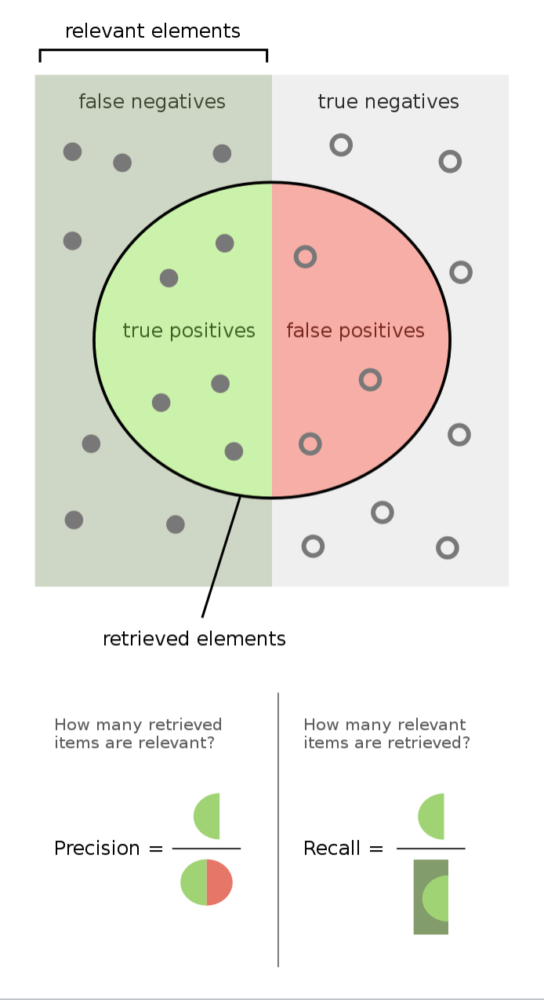

# Suggestion

Suggestion API is used to propose the related documents by search with **typos**.

Here, we have an index.

```json
POST /articles/_bulk
{"index":{"_id":1}}
{"title":"lucene is cool"}
{"index":{"_id":2}}
{"title":"Elasticsearch is built on lucene"}
{"index":{"_id":3}}
{"title":"Elastic is a company based on ELK stack"}
{"index":{"_id":4}}
{"title":"ELK stack is cool"}
```

## Term Suggestion

```json
POST /articles/_search
{
  "suggest": {
    "my-term-suggestion": {
      "text": "lucen rock", // search with typos
      "term": {
        "suggest_mode": "missing", // propose if the search has typos
        "field": "title"
      }
    }
  }
}
```

There are other `suggest_mode`.

- `popular`: propose the term that has higher frequency
- `always`: always propose

## Pharse Suggestion

It takes a longer context than _term suggestion_, and provides more configuaration.

```json
POST /articles/_search
{
  "suggest": {
    "my-phrase-suggestion": {
      "text": "lucne and elasticsear cool oh yeah",
      "phrase": {
        "field": "title",
        "max_errors": 2,
        "confidence": 1.5, // trigger this to have more or less suggestions
        "direct_generator": [
          {
            "field": "title",
            "suggest_mode": "always"
          }
        ]
      }
    }
  }
}
```

## Completion Suggestion

Instead of using **Inverted index**, analyzer compiles the data into **FST** and saves it with **index** in the cache. Therefore, it's very fast. But, It only suggests based on the **prefix**.

To use it, we have to, first, set a field as `completion`.

```json
PUT /articles
{
  "mappings": {
    "properties": {
      "title": {
        "type": "completion"
      }
    }
  }
}
```

What's more, we can add context into `mapping` for more precise completion.

Then, use suggestion API

```json
POST /articles/_search
{
  "suggest": {
    "my-completion-suggestion": {
      "prefix": "elk",
      "completion": {
        "field": "title"
      }
    }
  }
}
```

## Performance of 3 suggestions

- Precision

  Completion > Phrase > Term

- Recall

  Term > Phrase > Completion

- Performance

  Completion > Phrase > Term


