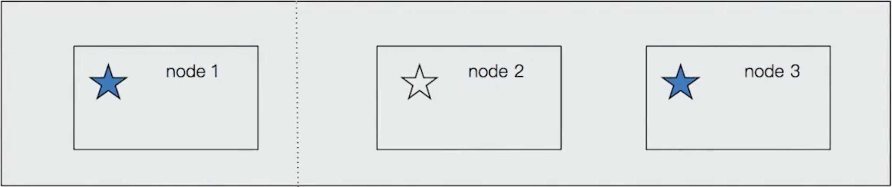
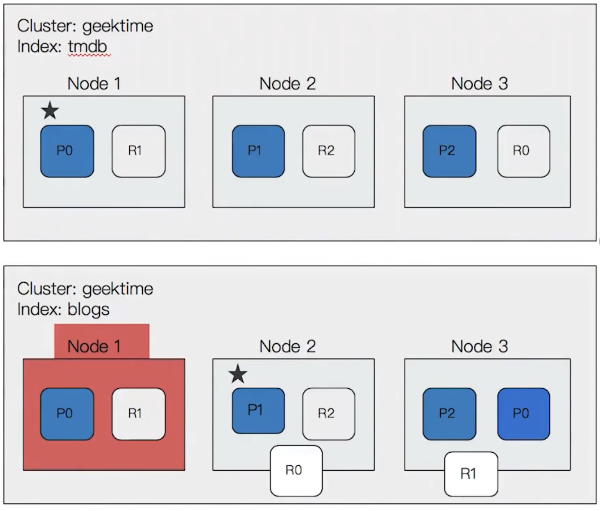
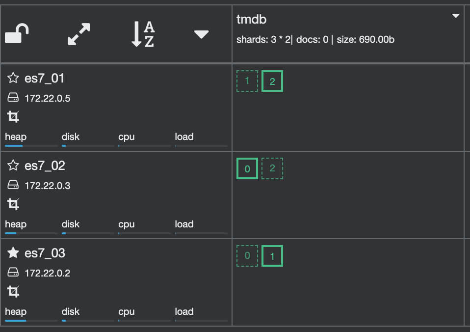
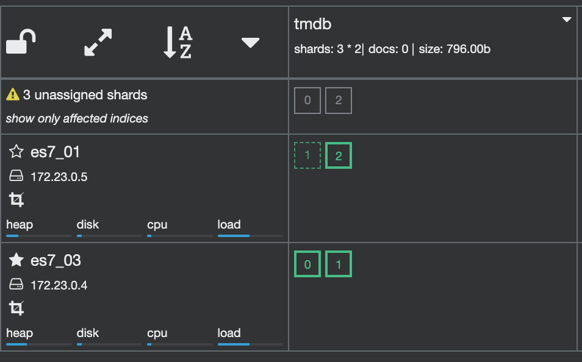
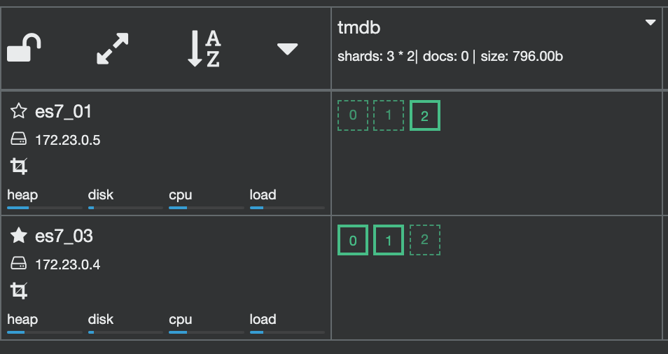

# Concept

## Node

A **process** of Elasticsearch. It's recommended to lanuch only one process per server.

- Coordinating Node: The node that processes the request. It **proxies** the requests to the correct nodes. All the nodes are this kind of node by default.

- Data Node: The node that saves data. The node is data node by default. We can change that by `node.data: false`.

- Master Node: The nodes that

  - handle create/delete index
  - decide the shard are set to which node
  - maintain the cluster state

  In a cluster, we usually create **more than one** master nodes. Each node works only as a master node.

  In a cluster, there are multiply **master eligible** node. It could be elected as the master node if the current one doesn't work. The node is master eligible by default. We can change that by `node.master: false`.

### Cluster State

The cluster state includes:

- the info of all the nodes
- the info of all the indexes and their `setting` and `mapping`
- the routing of shards

### Master eligible node

The nodes will **ping each other**, the node whose `node id` is the smallest will be elected as master node.

There is a classic problem of the distributed system, **Split-brain**.

If the `node1` is out of connection, the `node3` will be elected as a master. When `node1` is back to connection, there are 2 master nodes.



To avoid this problem, we should stop `node1` to be elected as the master. Therefore, we can set a **quorum**. Only if the **number** of master eligible nodes is **bigger** than quorum, the election can take place.

```code
quorum = (Total number of nodes / 2) + 1
```

Elasticsearch handled this for us.

## Shard

There are 2 kinds of shard, **primary shard** and **replica shard**.

- Primary shard

  We can spread the data of **an index** on different **data nodes** for the horizontal scaling.

  The primary shard is defined when creating an index, it can't be changed unless reindexing.

- Replica Shard

  It replicates the primary shard. It can be promoted as the primary shard when the primary one lost.

  It also improves **reading** performance. However, too many replica shards will have a negative impact on **writing** performance.

With **primary shard** and **replica shard**, ES can handle the accident of nodes.



For example, here are the shards of an index `tmdb`.

```json
PUT tmdb
{
  "settings": {
    "number_of_shards": 3,
    "number_of_replicas": 1
  }
}
```



Now, if the `node2` is down.



After a while, ES will relocate the shards.


