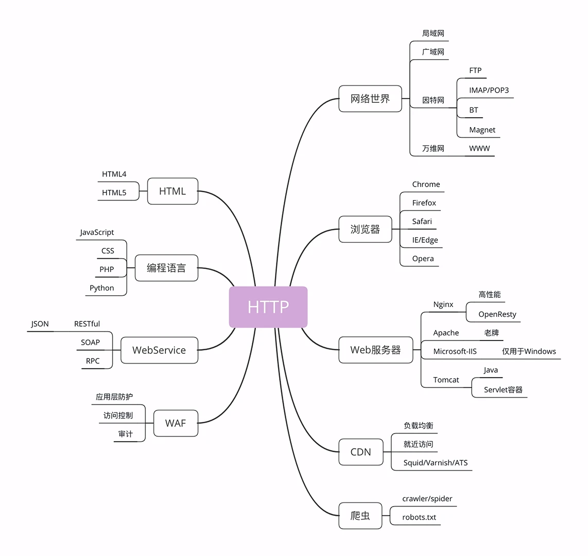
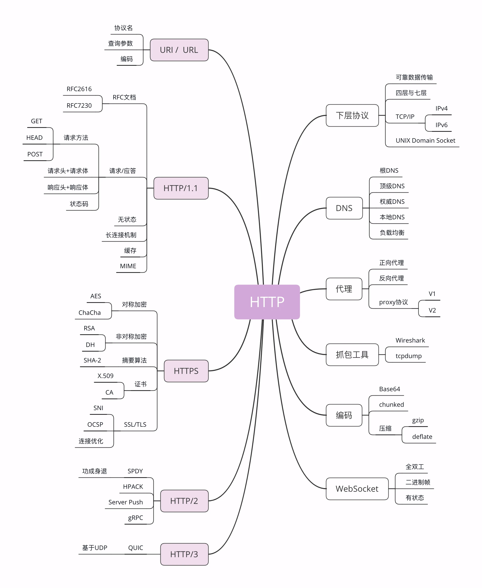
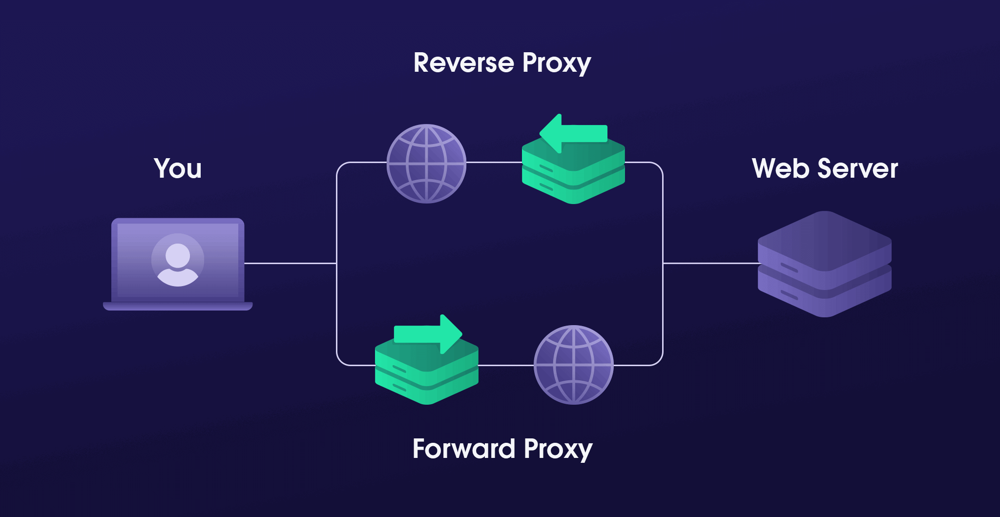

## Basic

### Concepts

#### CDN (Content Delivery Network)

It applies the **caching** and **proxy** technology in the HTTP protocol.

It replaces the origin site to respond to the client's request.

#### WAF (Web application firewall)

### HTTP

#### TCP/IP

TCP (Transmission Control Protocol), it makes sure the data is **complete** and **not missing**.

IP (Internet Protocol), it takes care of **addressing and routing**.

HTTP doesn't deal with the details, such as addressing, routing, data integrity, etc. **HTTP is create on the TCP/IP**.

#### DNS (Domain Name System)

It maps **domain Name** to **IP address**.

#### URI/URL

URI（Uniform Resource Identifier) is the **superset** of URL (Uniform Resource Locator).

URI has 3 parts: (`http://nginx.org/en/download.html`)

1. Protocal name: 
   
   `http://`, `ftp://`, `mailto:`, `tel:`, etc

2. Host name:

    `nginx.org`

3. Path:

    `/en/download.html`

#### HTTPS

It's **HTTP over SSL/TLS**.

SSL (Secure Socket Layer) /TLS (Transport Layer Security) is a protocal over **TCP/IP**. It's a **secure protocol for encrypted communication**.

#### Proxy

It's a "hub". It forwards the **client's request**, and also forwards the **server's response**.

It has several kinds.

- Anonymous proxy

  It discloses the originating IP address of the client.

- Transparent proxy

  It shows the originating IP address of the client.

- Forward proxy

  It's forwards **client's request**. For example, the browser is a forward proxy.

- Reverse proxy

  It forwards the **server's response**. It's at server-side.

CDN is a **Transparent Reverse** proxy.

Proxy can:

- **Load balancing**
  
  Distribute access requests to multiple machines

- **Context caching**

- **Protecting**

  Protect proxied host

- **Data processing**