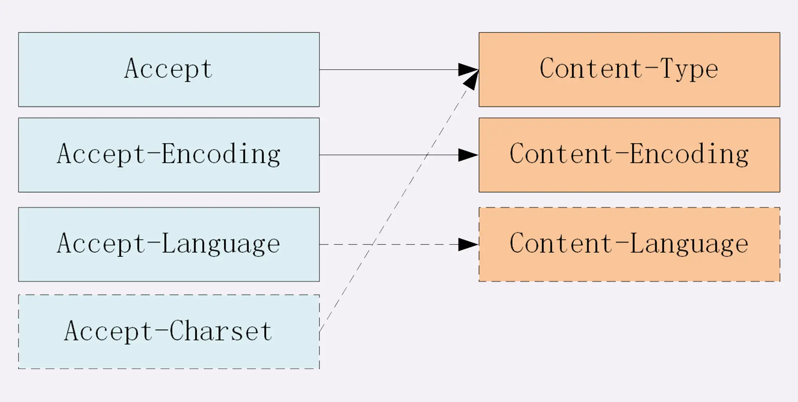

## Body



### Data type and Encoding

Http Body uses **MIME type** as data type.

> MIME is Multipurpose Internet Mail Extensions.

There are some categories.

- **text**: text/html, text/css, text/plain, ...

- **image**: image/gif, image/jpeg, image/png, ...

- **audio/video**: audio/mpeg, video/mp4, ...

- **application**: application/json, application/javascript, application/pdf

  If we don't know the type of "application", we use `application/octet-stream`

What's more, we need to know **Encoding type**.

There are 3 kinds.

- **gzip**: it's the most popular one.

- **deflate**

- **br**

### Data type headers

Once a http message has **MIME type** and **Encoding type**, we can seed it.

At client side, we need to add **Accept** to tell the server what kind of data is accepted.

```code
Accept: text/html,application/xml,image/webp,image/png
Accept-Encoding: gzip, deflate, br
```

At server side, the server will add the data type to the headers.

```code
Content-Type: text/html
Content-Encoding: gzip
```

If Encoding is not added, the message won't be compressed at server side, or compressed message won't be accepted.

### Language encoding

The **Unicode character set** that follows the **UTF-8 character encoding** is the standard character set on the Internet.

We set `Accept-Charset` or `Content-Type` in the headers.

```code
// client side

Accept-Language: zh-CN, zh, en
Accept-Charset: gbk, utf-8
```

```code
// server side

Content-Language: zh-CN
Content-Type: text/html; charset=utf-8
```

However, language and charactor set can be detected by both browser and server. Therefore, Only `Accept-Language` will be set at client side, and `Content-Type` is set by the server.

### Priority

Since a browser can accept multiple types of data, we can set the priority by `q`

```code
Accept: text/html,application/xml;q=0.9,*/*;q=0.8
```

That means `text/html` (q = 1.0) > `application/xml` (q = 0.9) > `*/*` (q = 0.8).

### Vary

```code
Vary: Accept-Encoding,User-Agent,Accept
```

That means the server sent the response according to `Accept-Encoding`, `User-Agent` and `Accept` in the resquest headers.

### Large body

To transfer the large body, there are several ways.

#### Compress

Using `Accept-Encoding` and `Content-Encoding`, we can compress the data. It works fine with **text**, but doesn't good for images or videos.

#### Chunk

We can chunk the body and sent them multiple responses.

In the response header, we set:

```code
Transfer-Encoding: chunked
```

> Since the body is chunked, the body length is unknown. Therefore, `Content-Length` is NOT set.

#### Range request

Range request allows the client requests **a part of** the body.

However, range request isn't supported by all the server. The server need to tell the client whether it can accept it.

```code
Accept-Ranges: bytes
```

If `Accept-Ranges` is missing, it means range request isn't supported.

Then, the client ask for the partial body.

```code
Range: bytes=0-31
```

The server receives the request.

- If it's out of range, return **416 Range Not Satisfiable**.

- If it's ok, return **206 Partial Content**

  The server need to add `Content-Range` to tell **the range and the length** of the body.

```code
Content-Length: 32
Accept-Ranges: bytes
Content-Range: bytes 0-31/96
```

We can asks for multiple ranges, too.

```code
Range: bytes=0-9, 20-29
```

The body will be split by **boundary**.

```code
HTTP/1.1 206 Partial Content
Content-Type: multipart/byteranges; boundary=00000000001
Content-Length: 189
Connection: keep-alive
Accept-Ranges: bytes


--00000000001
Content-Type: text/plain
Content-Range: bytes 0-9/96

// this is
--00000000001
Content-Type: text/plain
Content-Range: bytes 20-29/96

ext json d
--00000000001--
```

`--00000000001` is the separator.

`--00000000001--` is the end point.
