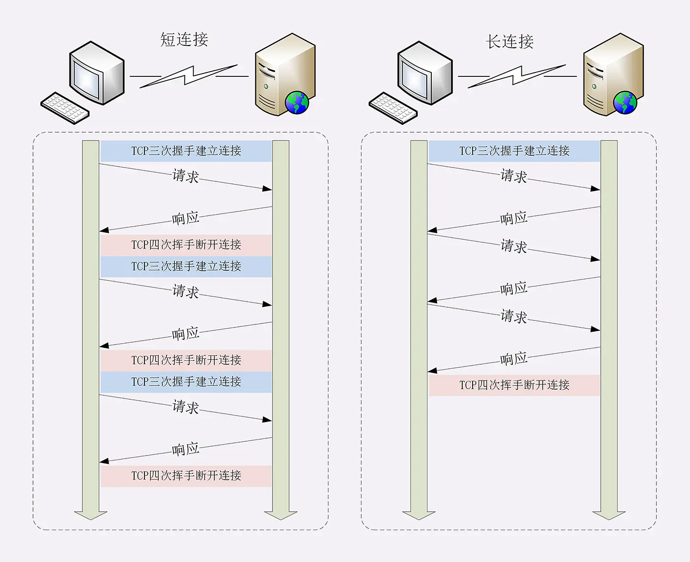

# Connection

## short-lived connections

At the early stage, Http uses short-lived connections.

It's not efficient because TCP connection costs a lot of time.

> To make a http connection, we need to make 3-ways handshake to etablish the connection, and 4-ways handshake to disconnect it.

## persistent connections



In http/1.1, persistent connection is set by default.

```code
Connection: keep-alive
```

However, persistent connections cost the resource of the server. There are several ways to close connection.

- add `Connection: close` at the request header to tell the server close the connection

- set Nignx config:

  - `keepalive_timeout`: max keepalive time of a persistent connection
  - `keepalive_requests`: max number of requests of a persistent connection

## Head-of-line blocking

Since the request-response is in a queue, if the head takes a lot time to process, then the rest is blocked.

There are some ways to solve it.

- concurrent connections

  We makes **multiple connections** between **a client and the server**. Usually, the number is 6 - 8.

- domain sharding

  We create **multiple domain names** of a server.
