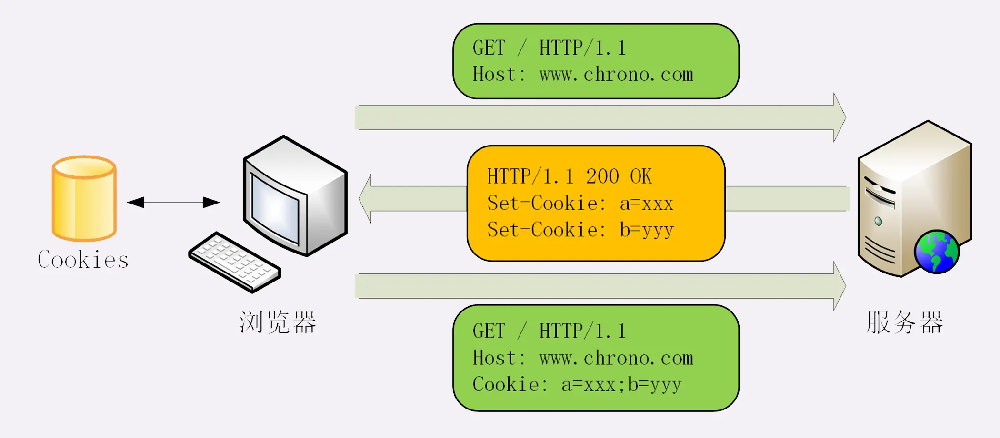

## Cookie

1. The client sends a request to the server **without cookie**.
2. The server reponses with the cookie by setting `Set-cookie` header.
3. The client requests with the cookie by setting the `Cookie` header.

### Cookie attributes

- Expires, Max-Age

  They set the expired time. `Expires` is a timestamp, `Max-Age` is an interval. `Max-Age` has the higher priority.

- Domain, Path

  They must match those in the request.

- HttpOnly

  Only Http can read the cookie. DOM API, like `document.cookie` can't visit it.

- SameSite

   - `SameSite=Strict`: Cookies cannot be sent across sites along with the redirect link.

   - `SameSite=Lax`: `GET`/ `HEAD` is allowed, `POST` NOT.

- Secure

  The cookie is only used in HTTPS.