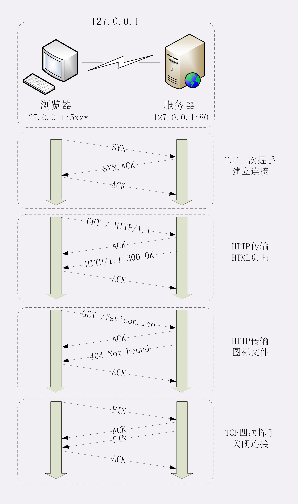

## What happens after entering an URL

In general, there are following steps.

1. TCP connection
2. HTTP transaction
3. TCP disconnection

In details,

1. Browser gets the **IP address** and **port** from URL.

   DNS not only returns the **server**'s IP address, but also the **CDN**'s address where the static files are cached.

2. Browser establishs **TCP connection** by **3-ways handshake**.
3. Browser sends http requests to the server.
4. Server receives the requests and sends the responses back.

   1. Once the server receive the requests. It will sends them the **correct machine** if a website has several machines.
   2. The host machine will first check the **cache**, such as Redis (memory-level), Varnish (disk-level). If the cache is found, return it.
   3. If the cache isn't found, the **web application**, such as Django, Tomcat, etc, takes cares of the requests. It may visit the **database** to get some data.
   4. The responses are sended back, and **the caches in CDN are updated**, too

5. Browser diconnects the server by **4-ways handshake**.
6. Browser renders the responses.