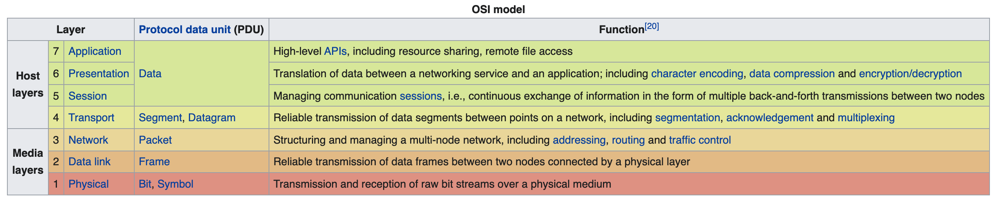
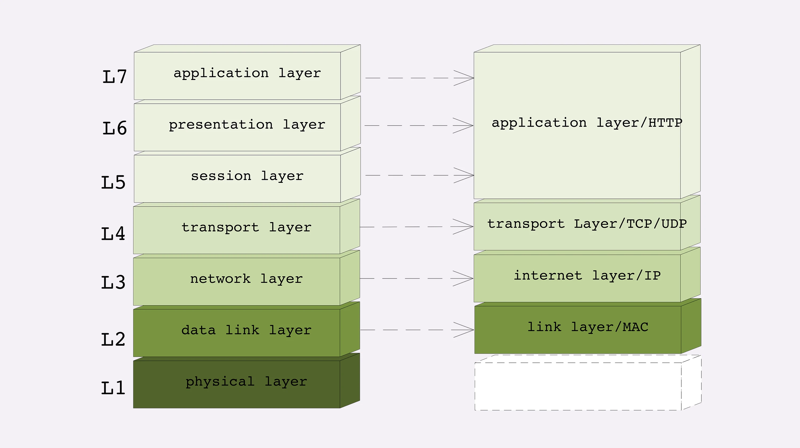

#  Layers

# #  TCP/IP Layers

From **bottom** to **top**, they are:

1. link layer

   It uses **MAC** address to identify the devices in the network.

   The unit of data in this layer is **frame**.

2. internet layer

   It uses **IP** address instead of MAC address. It connects the small networks into big one.

   The unit of data in this layer is **packet**.

3. transport layer

    It makes transportation work. **TCP** is on this layer.

    The unit of data in this layer is **segment**.

4. application layer

   **HTTP** is on this layer. There are other protocals, such as Telnet、SSH、FTP、SMTP.

   The unit of data in this layer is **message**.

# #  OSI (Open System Interconnection Reference Model)

There are 7 layers.

1. Physical

2. Data Link

3. Network

4. Transport

5. Session

6. Presentation

7. Application

We can map OSI layers and TCP/IP layers.

OSI | TCP/IP
--- | --- 
Physical |
Data Link | link layer 
Network | internet layer
Transport | transport layer
Session, Presentatio, Application | application layer

    