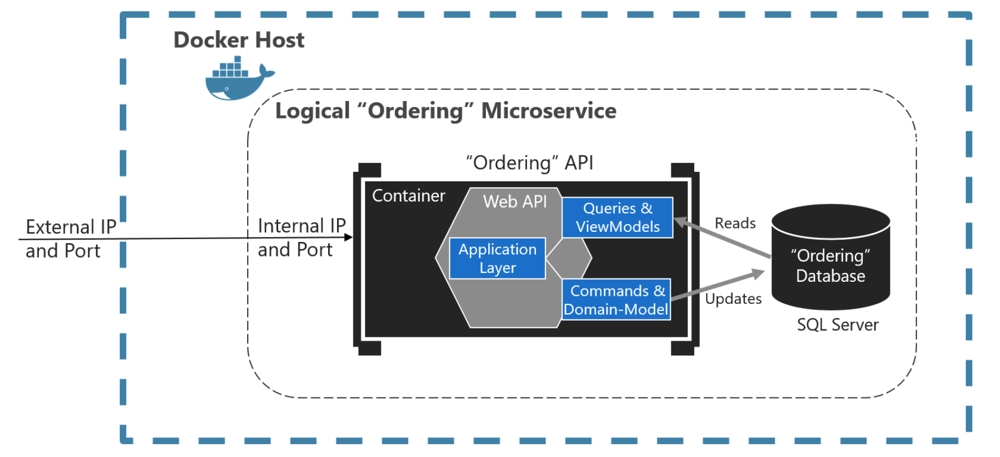
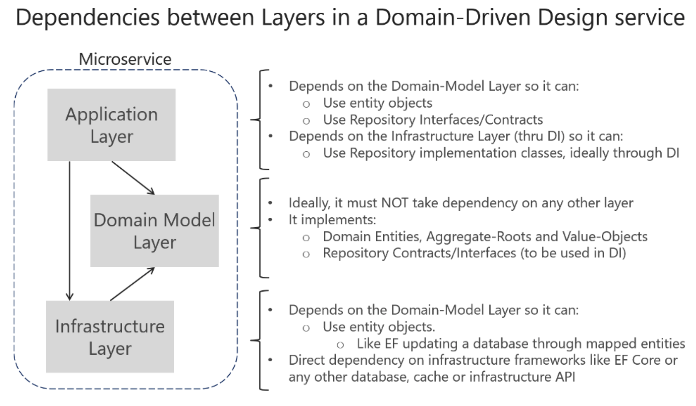

# Simplified CQRS and DDD patterns

CQRS (Command and Query Responsibility Segregation) is an architectural pattern that separates the models for reading and writing data.

- Queries. These queries return a result and do not change the state of the system, and they are free of side effects.

- Commands. These commands change the state of a system.

The separation aspect of CQRS is achieved by grouping query operations in one layer and commands in another layer. Each layer has its **own data model**. More importantly, the two layers can be within the same tier or microservice, or they could be implemented on different microservices or processes.

CQRS and most DDD patterns are not architectural styles, but only **architecture patterns**. Microservices, SOA (service-oriented architecture), and event-driven architecture (EDA) are examples of architectural styles.

- architectural styles: describe a system of many components

- architecture pattern: describe something inside a single system or component

## Design a DDD-oriented microservice

You can implement the most complex microservices following DDD patterns, while implementing simpler data-driven microservices (simple CRUD in a single layer) in a simpler way.

For DDD:

- You want to initially create the smallest possible microservices.

- You want to avoid chatty communications between microservices.

There are 3 layers in DDD:

- Application layer

- Domain model layer

- Infra layer

### Domain model layer

Responsible for representing concepts of the business, information about the business situation, and business rules. State that reflects the business situation is controlled and used here. This layer is the heart of business software.

Following the Persistence Ignorance and the Infrastructure Ignorance principles, this layer must completely ignore data persistence details. 

Domain entities should not have any direct dependency.

### Application layer

Defines the jobs the software is supposed to do and directs the expressive domain objects to work out problems.

This layer is kept thin. It does not contain business rules or knowledge, but only coordinates tasks and delegates work to collaborations of domain objects in the next layer down.

### Infrastructure layer

The infrastructure layer is how the data that is initially held in domain entities (in memory) is persisted in databases or another persistent store.