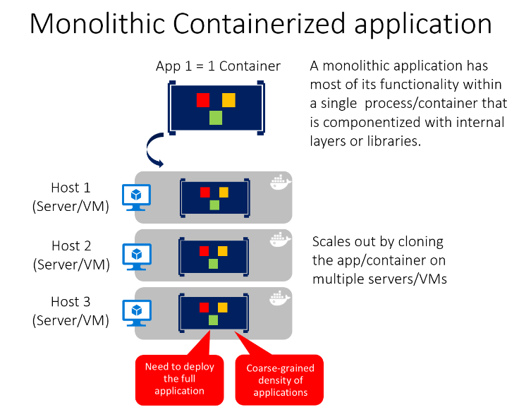
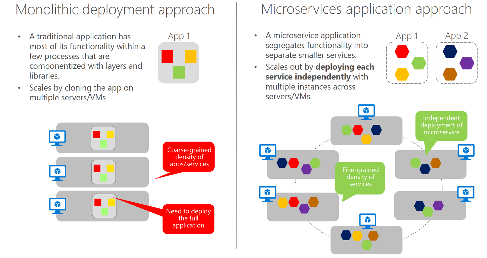
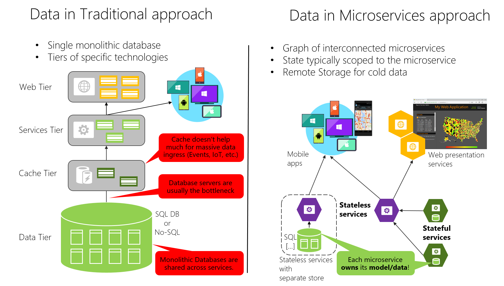
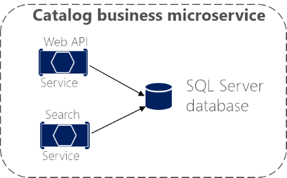

## Container design principles

When you design a container image, you'll see an [ENTRYPOINT](https://docs.docker.com/engine/reference/builder/#entrypoint) definition in the Dockerfile. This definition defines the **process** whose lifetime controls the lifetime of the **container**.

If the process fails, the container ends, and the **orchestrator** takes over. If the orchestrator was configured to keep five instances running and one fails, the orchestrator will create another container instance to replace the failed process.

## Containerizing monolithic applications

The downside of this approach becomes evident if the application grows, requiring it to **scale**. In most cases, just a few parts of the application are the choke points that require scaling, while other components are used less.

### Manage state and data in Docker applications
From Docker:
- **Volumes** are stored in an area of the host filesystem that's managed by Docker.
- **Bind mounts** can map to any folder in the host filesystem, so access can't be controlled from Docker process and can pose a security risk as a container could access sensitive OS folders.
- **tmpfs mounts** are like virtual folders that only exist in the host's memory and are never written to the filesystem.
From remote storage:
-   [Azure Storage](https://azure.microsoft.com/documentation/services/storage/), which provides geo-distributable storage, providing a good long-term persistence solution for containers.
-   Remote relational databases like [Azure SQL Database](https://azure.microsoft.com/services/sql-database/) or NoSQL databases like [Azure Cosmos DB](https://learn.microsoft.com/en-us/azure/cosmos-db/introduction), or cache services like [Redis](https://redis.io/).

#### Service-oriented architecture (SOA)
SOA means that you structure your application by decomposing it into multiple services.

### Microservices architecture
It's an approach to building a server application as **a set of small services**.
Each service **runs in its own process** and **communicates with other processes using protocols** such as HTTP/HTTPS, WebSockets.
Each microservice implements a specific end-to-end domain or business.  Each microservice should own its related **domain data model and domain logic**.

The following are important aspects to enable success in going into production with a microservices-based system:

- Monitoring and health checks of the services and infrastructure.
- Scalable infrastructure for the services (that is, cloud and orchestrators).
- Security design and implementation at multiple levels: authentication, authorization, secrets management, secure communication, etc.
- Rapid application delivery, usually with different teams focusing on different microservices.
- DevOps and CI/CD practices and infrastructure.

### Data sovereignty per microservice

An important rule for microservices architecture is that each microservice **must own its domain data and logic**. This principle is similar in [Domain-driven design (DDD)](https://en.wikipedia.org/wiki/Domain-driven_design), where each [Bounded Context](https://martinfowler.com/bliki/BoundedContext.html) or autonomous subsystem or service must own its domain model (data plus logic and behavior).

A monolithic application with typically a single relational database has two important benefits: [ACID transactions](https://en.wikipedia.org/wiki/ACID) and the SQL language.

However, data access becomes much more complicated when you move to a microservices architecture. Even when using ACID transactions within a microservice or Bounded Context, it is crucial to consider that the data owned by each microservice is **private to that microservice** and should only be **accessed either synchronously through its API endpoints**(REST, gRPC, SOAP, etc) or **asynchronously via messaging**(AMQP or similar).

Microservices-based applications often use a mixture of SQL and NoSQL databases, which is sometimes called the [polyglot persistence](https://martinfowler.com/bliki/PolyglotPersistence.html) approach.

Each microservice owns its related data. In addition, each BC usually has its own [ubiquitous language](https://martinfowler.com/bliki/UbiquitousLanguage.html) to help communication between software developers and domain experts.

## Logical architecture versus physical architecture

A business microservice or Bounded Context is a logical architecture that might coincide (or not) with physical architecture. 

The important point is that a business microservice or Bounded Context must be **autonomous** by allowing code and state to be independently versioned, deployed, and scaled.

The catalog business microservice could **be composed of several services or processes**. More importantly, the services could **share the same data**, as long as these services are **cohesive with respect to the same business domain**.